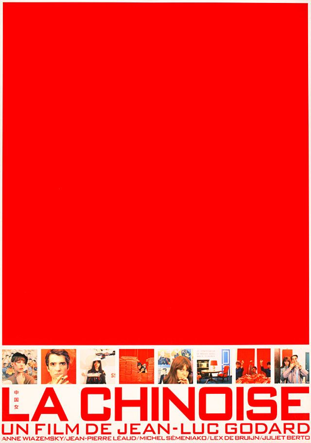

## Meredith Lackey

**February 7, 2019**

Meredith Lackey is a filmmaker based in Los Angeles who recently had her latest film Cablestreet premier at the Sundance Film Festival. We collaborated to create a [sleek portfolio](https://mlackey-demo.netlify.com/) for her that is built in React.

[View full code](https://github.com/neil-berg/mlackey)

### Design

Meredith shared several vintage and modern movie posters that she wanted to incorporate into the style of her site. Here are a couple of them:




The use of thumbnails to create borders in these posters was immediately appealing and aligned naturally with Meredith's film catalogue. The striking solid red landing backdrop in the second poster was another feature we wanted to include in the site.

We ended up using the red color from the second poster (#e62020) and paired it with a deep black (#140101) for text and soft white (#fff9f1) for active and hover states and for page/image margins. The result is a bold and minimal showcase of Meredith and her work:


###Creating the side gallery

This React app has three general components:

1. SideGallery - the left-sidebar of thumbnail images
2. NavBar - the top navigation panel
3. About/Contact/Work - the main content of the site displayed beneath the NavBar

`SideGallery` needs to know two values to get initialized:

1. What is the viewport height when the app first mounts?
2. Is the content next to `SideGallery` (i.e. height of `NavBar` + height of main content) taller or shorter than the viewport height?

If the viewport height is taller than the combined height of `NavBar` and the content beneath it, then we know that `SideGallery` should vertically span 100% of the viewport height (aka 100vh).

Though suppose we have a very short viewport height (e.g. mobile device on its side) or a case where the content in say the `Work` component contained 10 films that pushed text way beneath the fold of the viewport height. In these cases, `SideGallery` needs to vertically extend beyond 100vh to cover the `NavBar` and the height of the main section being displayed beneath it.

The results of these questions are used to calculate `galleryHeight`, which is stored as application-level state in `App.js`. It is set through a method called `setGalleryHeight` that is passed as props to children components like `Work`. When `Work` mounts, for example, we sum the client height of that section with how far offset it is from the top of the page to calculate `galleryHeight`. A 10px margin-bottom to is also factored in to this height. And since we're reaching into the DOM to access the client height of the `Work` component, we need to first make a ref to it in its render method.

**App.js**

<!-- prettier-ignore -->
```javascript
class App extends React.Component {
  state = {
    galleryHeight: null,
  }

  setGalleryHeight = height => {
    this.setState({ galleryHeight: height });
  }

  //...
}
```

**Work.js**

<!-- prettier-ignore -->
```javascript
class Work extends React.Component {
  componentDidMount() {
    const sectionHeight = this.sectionRef.clientHeight;
    const sectionOffsetTop = this.sectionRef.offsetTop;
    const galleryHeight = sectionOffsetTop + sectionHeight - 10;
    this.props.setGalleryHeight(galleryHeight);
  }

  render() {
    return (
      <main ref={sectionRef => (this.sectionRef = sectionRef)}>
        // Other JSX pertaining to this section
      </main>
    )
  }
  //...
}
```

We then pass `galleryHeight` down as a prop to the `SideGallery` component to set its height (more on that below). The number of thumbnail images to display within the gallery are then computed based on this height. A helper function called `numImages` is created to calculate this quantity:

**helper.js**

<!-- prettier-ignore -->
```javascript
export const numImages = (galleryHeight) => {
  const size = 50;

  const possibleImages = Math.floor(galleryHeight / size);
  // Account for 10px spacing between each box
  const totalMargin = (possibleImages - 1) * 10;
  const imagesToRemove = Math.ceil(totalMargin / size);
  const totalImages = possibleImages - imagesToRemove;
  return totalImages;
};
```

Each thumbnail is a fixed size of 50px x 50px. The total _possible_ number of images is then the rounded-down ratio of the gallery height to each image height (50px). We also need to account for at least a 10px spacing between each possible image, equal to `(possibleImages - 1) * 10`. One is subtracted from the number of possible images in this equation since every image minus the last one needs a margin-bottom of at least 10px. (Note: There's already a 10px soft-white margin along the entire gallery.)

The total spacing needed in the gallery is then translated to an equivalent number of excess images that need to be removed from the initial image count. This is the rounded-up value of the total margin spacing divided by the image size. By subtracting that value from the total possible number of images, we have the correct number of images - accounting for margins - in the gallery.

Returning to the `SideGallery` component, all the information is now gathered to populate the gallery with thumbnail images. Since thumbnais have to be dynamically pulled in, we can't simply [import the images](https://facebook.github.io/create-react-app/docs/adding-images-fonts-and-files) from a path inside /src. Instead, thumbnails are stored in the app's /public directory and placed in `` tags inside of a `map` statement.

<!-- prettier-ignore -->
```
public
  /assets
      gallery_1.png
      gallery_2.png
      ...
      gallery_15.png
```

**SideGallery.js**

<!-- prettier-ignore -->
```javascript

import React from 'react';
import styled from 'styled-components';

import { numImages } from '../helper';

const ImageContainer = styled.div`
  // To be filled in soon
`

const SideGallery = ({ galleryHeight }) => {
  const num = numImages(galleryHeight);
  const imageList = Array(num)
    .fill()
    .map((_, i) => (
      
    ));

  return (
    <ImageContainer galleryHeight={galleryHeight}>
      {imageList}
    </ImageContainer>
  );
};

```

Since we have 15 thumbnails to work with, a condition is included that checks whether more than 15 images are needed for a very tall gallery. If so, images with indices of 15 or higher are simply a random image from the 15 we have access to.

###Styling the side gallery

The final piece of the side gallery is styling it so that:

1. its height equals the `galleryHeight` value in state
2. is pinned to the left edge of the page
3. has evenly spaces images

A [styled component](https://www.styled-components.com/) called `ImageContainer` is used to accomplish this.

Since each thumbnail image is 50px, the width of `ImageContainer` is fixed to 50px. A 10px soft-white margin is also placed around the container.

The container's height is dictated by the value of `galleryHeight` stored in state, passed to `SideGallery` as a prop, and further passed as a prop to the styled component `ImageContainer`.

To pin the gallery to the left of the page, it is positioned absolutely in the upper left corner.

Finally, [flex-box](https://css-tricks.com/snippets/css/a-guide-to-flexbox/) is used in the column-direction to center each image along the cross-axis (rows in this case) and apply equal spacing between images along the main-axis (columns in this case).

<!-- prettier-ignore -->
```javascript
const ImageContainer = styled.div`
  width: 50px;
  height: ${props => props.galleryHeight}px;
  position: absolute;
  top: 0px;
  left: 0px;
  margin: 10px;
  display: flex;
  flex-direction: column;
  align-items: center;
  justify-content: space-between;
`
```

###Smooth page transitions

Enacting silky smooth page transitions is accomplished with the [react-transition-group](https://reactcommunity.org/react-transition-group/) package:

`npm install --save react-transition-group`

With that package installed, we just need to wrap content with the `CSSTransitionGroup` component and specify enter/exit properties to get the smooth transition effect. For instance:

**Work.js**

<!-- prettier-ignore -->
```javascript
import React from 'react';
import { CSSTransitionGroup } from 'react-transition-group';

class Work extends React.Component {
  componentDidMount() {
    //...
  }

  render() {
    return (
      <main ref={sectionRef => (this.sectionRef = sectionRef)}>
        <CSSTransitionGroup
          transitionName="fade"
          transitionAppear={true}
          transitionAppearTimeout={400}
          transitionEnter={false}
          transitionLeave={false}
        >
          <div>
            // other JSX here
          </div>
        </CSSTransitionGroup>
      </main>
    )
  }
  //...
}
```

Simple as that! I'm also learning [react-spring](https://www.react-spring.io/) and plan to use that package for future animations and transitions.
