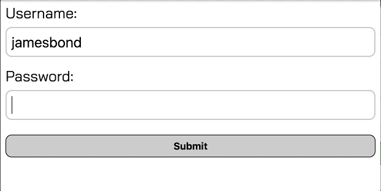

## Regular Expressions for Regular People

**May 28, 2019**

Equally elegant and mysterious, regular expressions are a critical tool for input validation, string manipulations, and a host of other tasks. Their syntax can be daunting at first, but there is a clear logic between the slashes, and I find that it's best revealed through stepping through a handful of examples.

As such, this post covers the creation and application of some common uses of regular expressions in JavaScript. It is intended for regular people. By that I mean people like me, people who are not RegExperts, but commonfolk who only occasionally need to reach for them.

### Creating regular expressions

There are two ways to create a regular expression (RegEx):

1. RegEx literal of a pattern in between slashes

   - Most common creation method
   - Used when you know the pattern upfront and it does not change

   <!-- prettier-ignore -->

```javascript
const re = /flower/
```

2. Constructor function RegExp

   - Used when the pattern is not known unfront, but changes during code execution or pattern comes from user input or external sources

<!-- prettier-ignore -->
```javascript
const re = new RegExp('flower')
```

### Testing regular expressions

There are two ways to test a regular expressions:

1. Using methods of the RegExp object:

   - `test` - returns true if matched or false if no match
   - `exec` - returns array of matched details or null if no match

<!-- prettier-ignore -->
```javascript
/flower/.test('flowerpot')
// true 
```

<!-- prettier-ignore -->
```javascript
/flower/.exec('flowerpot')
// ["flower", index: 0, input: "flowerpot", groups: undefined]
// returned details include: matched text, starting index of the match
// and the original text input
```

2. Using methods of the String object:
   - `match` - returns array of matched details or null if no match
   - `replace` - returns new string with matched text replaced with defined new text
   - (less common): `search` and `split`

<!-- prettier-ignore -->
```javascript
'Los Angeles, California'.match(/California/)
//["California", index: 13, input: "Los Angeles, California", groups: undefined]
```

<!-- prettier-ignore -->
```javascript
'Los Angeles, California'.replace(/California/, 'CA')
// "Los Angeles, CA"
```

Finally, there is a wonderful online tool called [Regular Expressions 101](https://regex101.com/) that allows for interactive testing of patterns. Explanations are also provided for why matches occurred.

### Flags

Flags can be attached to patterns that modify the search parameters. Common flags include:

- `g` - global matching, aka find all matches
- `i` - case insensitive, aka ignore casing

<!-- prettier-ignore -->
```javascript
'one hat two hat red had blue hat'.match(/hat/g)
// ["hat", "hat", "hat"]
```

<!-- prettier-ignore -->
```javascript
'App.js app.js wrapper.js'.match(/app/gi)
// ["App", "app", "app"]
```

### Quantifiers

Certain quantifying characters and expressions can be included after patterns to refine their specificity.

#### Optional matching with `?`

<!-- prettier-ignore -->
```javascript
/colou?r/.test('color')
// true 
// The "u" is optional
```

#### One or more matches with `+`

<!-- prettier-ignore -->
```javascript
'yassss queen'.match(/yas+/)
// ["yassss", index: 0, input: "yassss queen", groups: undefined]
// The "s" is matched one or more times (4 times in this case)
```

#### None, one or more matches with `*`

<!-- prettier-ignore -->
```javascript
'ya queen'.match(/yas*/)
// ["ya", index: 0, input: "ya queen", groups: undefined]
// The "s" does not need to be matched
```

#### "Starts with" using `^`

<!-- prettier-ignore -->
```javascript
/^App/.test('App.js');
// true
```

#### "Ends with" using `$`

<!-- prettier-ignore -->
```javascript
/js$/.test('App.js');
// true
```

#### Match an exact _n_ number of times using `{n}`

<!-- prettier-ignore -->
```javascript
/5{3}/.test('555');
// true
// Three 5's are exactly matched
```

#### Match at least _n_ number of times using `{n,}`

<!-- prettier-ignore -->
```javascript
/5{3,}/.test('5555');
// true
// At least three 5's are matched
```

#### Match between _n_ and _m_ number of times using `{n,m}`

<!-- prettier-ignore -->
```javascript
/5{1,4}/.test('55');
// true
// Between one and four 5's are matched
```

### Metacharacters

In addition to letters and digits, regular expressions can also be composed with metacharacters, which are always prefaced by a backslash. A few common metacharacters include:

- `\w` - any alphanumeric or word character
- `\W` - any non-alphanumeric or word character

<!-- prettier-ignore -->
```javascript
'R2-D2'.match(/\w{2}\W\w{2}/);
// ["R2-D2", index: 0, input: "R2-D2", groups: undefined]
// Two word characters (R2), then one non-word character (-), then
// two word characters (D2) are matched
```

- `\d` - any digit
- `\D` - any non-digit

<!-- prettier-ignore -->
```javascript
'C-3PO'.match(/\D{2}\d\D{2}/);
// ["C-3PO", index: 0, input: "C-3PO", groups: undefined]
// Two non-digits (C-), then one digit (3), then
// two non-digits (PO) are matched
```

- `\s` - any whitespace character (space, tab, newline)
- `\S` - any non-whitespace character

<!-- prettier-ignore -->
```javascript
'apples or oranges'.match(/\S+\s\S+\s\S+/);
// ["apples or oranges", index: 0, input: "apples or oranges", groups: undefined]
// One or more non-whitespace characters (apples), then a whitespace,
// then one or more non-whitespace characters (or), then a whitespace,
// then one or more non-whitespace characters (oranges) are matched
```

### Multiple patterns with "or" operator

The OR operator in regular expressions is defined by the pipe `|`. This allows for a positive match to occur if at least one of multiple patterns are found.

<!-- prettier-ignore -->
```javascript
'555'.match(/\d{3}|\(\d{3}\)/)
// ["555", index: 0, input: "555", groups: undefined]
// 555 is matched by \d{3}
```

<!-- prettier-ignore -->
```javascript
'(555)'.match(/\d{3}|\(\d{3}\)/)
// ["(555)", index: 0, input: "(555)", groups: undefined]
// (555) is matched by \(\d{3}\)
// Note: parentheses in literal form need to be escaped by backslahes
```

### Character sets

Square brackets define sets of characters that match when _any_ character in that set is matched:

<!-- prettier-ignore -->
```javascript
/[A-Z]\d-[A-Z]\d/.test('R2-D2')
// true since the following is matched:
// any uppercase letter, digit, hypen, any uppercase letter, digit
```

<!-- prettier-ignore -->
```javascript
/[A-D]-[0-4][N-Q][N-Q]/.test('C-3PO')
// true since the following is matched:
// any uppercase letter between A and D, hypen, any digit between 0 and 4, 
// any uppercase letter between N and Q, any uppercase letter between N and Q
```

When used _inside_ of a character set, the caret `^` creates an invert set, aka match anything _but_ those characters.

<!-- prettier-ignore -->
```javascript
/[^A-Q]\d-[^A-C]\d/.test('R2-D2')
// true since the following is matched:
// any uppercase letter not between A and Q, digit, hypen,
// any uppercae letter not between A and C, digit
```

### Capturing groups

Patterns enclosed by parentheses are called capturing groups. This allows the pattern to be referenced later in the regular expression or be referenced in the array of matched details.

<!-- prettier-ignore -->
```javascript
/(\w+)\s\1\s\w+\s(\w+)\s\2/.test('same same but different different')
// true
// capture group 1 is "same"
// capture group 2 is "different"
// \1 and \2 reference "same" and "different", respectively
// true since the following is matched:
// one or more word characters (capture group 1), whitespace, 
// value of capture group 1, whitespace, one or more word characters, 
// one or more word characters (capture group 2), whitespace,  
// value of capture group 2 
```

Using the `exec` RegExp method, we can more clearly see the details of this regular expressions:

<!-- prettier-ignore -->
```javascript
/(\w+)\s\1\s\w+\s(\w+)\s\2/.exec('same same but different different')
// "same same but different different", "same", "different", index: 0, 
// input: "same same but different different", groups: undefined]
```

The returned result includes:

- substring that was matched
- capture groups (e.g. "same" and "different")
- starting index of the first match
- original text

Capture groups can also used to replace repeating words in a sentence.

<!-- prettier-ignore -->
```javascript
'My name name is is Neil'.replace(/(\w+)\s\1/g, '$1');
// "My name is Neil"
```

The regular expression matches all occurrences of one or more word characters (capture group) followed by a space followed by the value of that capture group. Since the global flag is used, this matches "name name" and "is is". "name" is the value of the capture group in the first match and "is" is the value of the capture group in the second match. `\1` references the value of the capture group inside the regular expression, while `'$1'` references the capture group as the second argument to the `replace` method. Thus, the matched text of "name name" and "is is" is replaced with "name" and "is", respectively.

Similarly, capture groups can be used to rearrange words in a sentence.

<!-- prettier-ignore -->
```javascript
'James Bond'.replace(/(\w+)\s(\w+)/, 'My name is $2, $1 $2');
// "My name is Bond, James Bond"
```

The matched text is "James Bond", where "James" is the value of capture group 1 and "Bond" is the value of capture group 2. We replace that matched text with "My name is" followed by the value of capture group 2, a comma, and then the values of capture groups 1 and 2.

### Lookaheads

Lookaheads allow for a match only when one pattern is followed ("positive lookahead") or is not followed ("negative lookahead") by another pattern. Positive lookaheads are created with `pattern1(?=pattern2)` and negative lookaheads are created with `pattern1(?!pattern2)`.

The following examples also introduce the `.` wildcard, which enables a match on any character.

<!-- prettier-ignore -->
```javascript
/(.)+(?=Berg)/.test('Neil Berg');
// True
// "Berg" follows any one or more characters (Neil )
```

<!-- prettier-ignore -->
```javascript
/(.)+(?!Berg)/.test('Neil Diamond');
// True
// "Berg" does not follow any one or more characters
```

### Example: Password Validation

Suppose we enact the following password rules for a user login:

- must include at least 1 number
- must include lower and uppercase letters
- must inclued at least 1 special character (!@#\$%^&)
- must be at least 8 characters long

These conditions can be represented by the following regular expression:

`/(?=.*\d)(?=.*[a-z])(?=.*[A-Z])(?=.*[!@#$%^&*]).{8,}/`

Four positive lookaheads are used to check whether anywhere in the text is followed by any character zero or more times and a:

1. digit: `(?=.*\d)`
2. lowercase letter: `(?=.*[a-z])`
3. uppercase letter: `(?=.*[A-Z])`
4. special character: `(?=.*[!@#$%^&*])`

Finally, the text must be at least 8 characters long `.{8,}`

Interestingly, Javascript is not even needed to test regular expressions on text, date, search, url, tel, email, and password inputs in HTML. These inputs can accept a [pattern attribute](https://www.w3schools.com/tags/att_input_pattern.asp) containing a regular expression that is used to checked against form submission. Once the regular expression is matched, the form be submitted.

Let's create a username/password form where the password input has a pattern attribute. A title attribute can also be included that will be shown if a user tries to submit before passing the pattern check.

```html
<div class="form-container">
  <form>
    <label for="username">Username: </label>
    <input type="text" id="username"required>
    <label for="password">Password: </label>
    <input
      type="text"
      id="password"
      pattern="(?=.*\d)(?=.*[a-z])(?=.*[A-Z])(?=.*[!@#$%^&*]).{8,}"
      title="Must contain at least one number, uppercase letter,
      lowercase letter, and special character, and be at least 8
      or more characters long"
      required>
    <input type="submit" id ="submit" value="Submit">
  <form>
</div>
```



OK, I also added an event listener to the password input that tests the regular expression after each keyup. Once the validation is true, the submit button changes from grey to green:

<!-- prettier-ignore -->
```javascript
const submit = document.getElementById('submit');
const password = document.getElementById('password');

function validate() {
  const re = /(?=.*\d)(?=.*[a-z])(?=.*[A-Z])(?=.*[!@#$%^&*]).{8,}/;
  if (re.test(password.value)) {
    submit.style.background = '#039b1c';
    submit.style.color = '#F3F3F3';
  } else {
    submit.style.background = '#ccc';
    submit.style.color = "black";
  }
}

password.addEventListener('keyup', validate);
```
