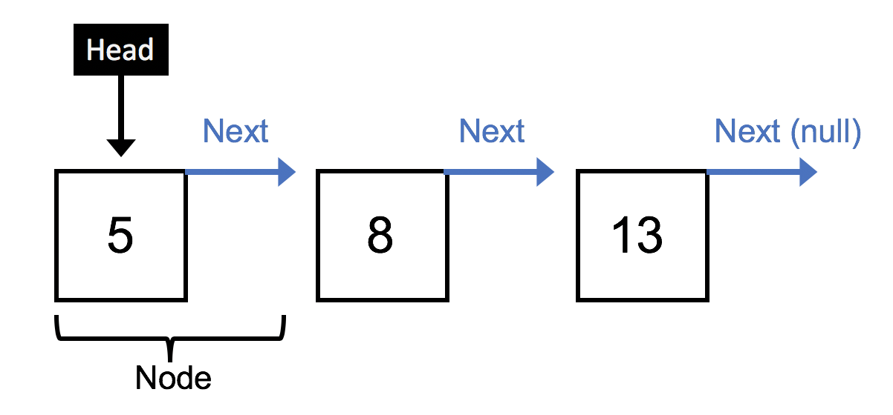
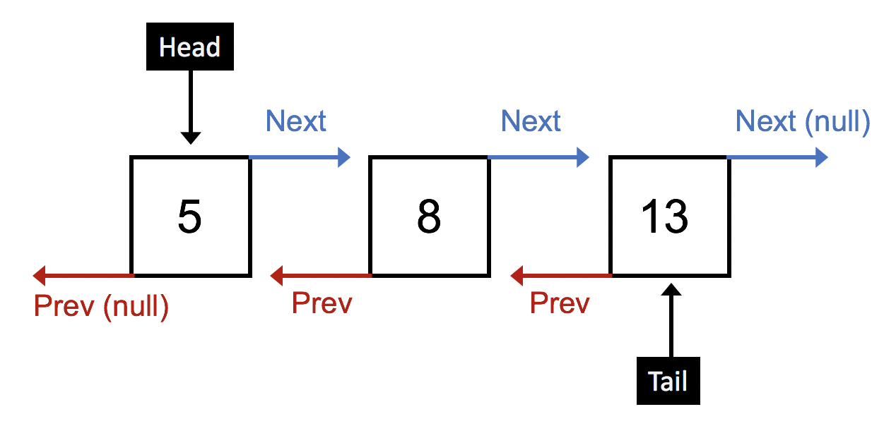

## Leaping Into Linked Lists

**June 16, 2019**

When working with arrays, _finding_ the point of insertion/deletion is constant in time but _performing_ the insertion/deletion is O(n). This potentially costly operation happens since elements in arrays are allocated contiguously in memory, leading to a reorganization of the structure while performing the insertion/deletion.

On the flip side, linked lists, which are comprised of nodes containing a data value and a pointer to the next node (and previous node in the case of doubly linked lists), allow for constant-time insertion/deletion of elements. This performance gain - relative to arrays - occurs since we only need to track the current pointer in memory during traversal and re-assign that pointer when the target element is added or removed.

In other words, regardless of the linked list size, the act of insertion/deletion requires a single action of pointer reassignment, i.e., O(1) time complexity. Though, the traversal to find the element to add/remove has a complexity of O(n). In summary, the time complexities of insertion/deletion between arrays and linked lists are:

**Arrays**

- Finding the point of insertion/deletion: O(1)
- Performing the point of insertion/deletion: O(n)

**Linked Lists**

- Finding the point of insertion/deletion: O(n)
- Performing the point of insertion/deletion: O(1)

Let's leap into the world of singly and doubly linked lists.


### Singly linked lists

Singly linked lists are defined by nodes, which are plain objects, that contain two properties:

1. A value, such as an integer or a string
2. A pointer to the _next_ node in the list, or null if at the end of the list.

The list itself also has two properties:

1. A _head_ whose value points to the first node in the list
2. A length

For instance, a singly linked list with three nodes containing the values of 5, 8, and 13 looks like:



#### Creating Node and SinglyLinkedList Classes

Using ES6 classes as syntactic sugar for prototypal inheritance, we can start by defining classes for nodes and the singly linked list structure.

Each `Node` in the list is instantiated with some value (e.g. an integer) and an initial `next` property set to `null`.

<!-- prettier-ignore -->
```javascript
class Node {
  constructor(value) {
    this.value = value;
    this.next = null;
  }
}
```

A new instance of `Node` is created with the `new` operator and the desired value passed into it:

<!-- prettier-ignore -->
```javascript
const node = new Node(5);
console.log(node);
// Node { value: 5, next: null }
```

The list is instantiated by defining two properties: a `head` that initially is set to null and a `length` that is initially zero.

<!-- prettier-ignore -->
```javascript
class SinglyLinkedList {
  constructor() {
    this.head = null;
    this.length = 0;
  }

  // Methods to be added next
  add(value) {}
  addAt(k, value) {}
  remove(value) {}
  removeAt(k) {}
  indexOf(value) {}
  nodeAt(k) {}
}

const sll = new SinglyLinkedList();
console.log(sll);
// SinglyLinkedList { head: null, length: 0 }
```

A new instance of SinglyLinkedList is created with the `new` operator:

<!-- prettier-ignore -->
```javascript
const sll = new SinglyLinkedList();
```

#### Adding Nodes

Adding a node at the end of a singly linked list takes the following steps:

1. Create a new node with the inputted value.
2. Check if the list is empty, i.e., the `head` is `null`.
3. If empty, set the list's head to the new node.
4. If not empty, traverse the list until the last node (which has a `next` value of `null`) is found, then set the last node's `next` property to point to the new node.
5. Increment the list's length.

<!-- prettier-ignore -->
```javascript
add(value) {
  const node = new Node(value);
  
  if (!this.head) {
    this.head = node;
  } else {
    let current = this.head;
    while (current.next) {
      current = current.next;
    }
    current.next = node;
  }
  this.length++;
}

//
const sll = new SinglyLinkedList();
sll.add(5);
sll.add(8);
sll.add(13);
console.log(JSON.stringify(sll, null, 4))
// {
//     "head": {
//         "value": 5,
//         "next": {
//             "value": 8,
//             "next": {
//                 "value": 13,
//                 "next": null
//             }
//         }
//     },
//     "length": 3
// }
```

#### Adding Node at Index _k_

Adding a node at an index _k_ is accomplished with the following steps:

1. Ensure that index _k_ is non-negative and less than the list's length.
2. Create a new node with the inputted value.
3. If _k_ = 0, set the new node's `next` value to the initial `next` value of the list's `head` and reassign the `head` to the new node.
4. If _k_ > 0, loop _k_ times starting at the `head` and track the `previous` and `current` nodes during the traversal. These nodes are used to bracket the new node in the next step.
5. Set the `previous` node's `next` value to the new node and the new node's `next` value to the `current` node.
6. Increment the list's length.

<!-- prettier-ignore -->
```javascript
  addAt(k, value) {
    if (k < 0 || k > this.length) {
      return false;
    }

    const node = new Node(value);
    if (k === 0) {
      node.next = this.head.next;
      this.head = node;
    } else {
      let current = this.head;
      let previous = undefined;
      for (let i = 0; i < k; i++) {
        previous = current;
        current = current.next;
      }
      previous.next = node;
      node.next = current;
    }
    this.length++
  }

// Example -- 
const sll = new SinglyLinkedList();
sll.add(5);
sll.add(8);
sll.add(13);
sll.addAt(2, 10);
console.log(JSON.stringify(sll, null, 4));
// {
//     "head": {
//         "value": 5,
//         "next": {
//             "value": 8,
//             "next": {
//                 "value": 10,
//                 "next": {
//                     "value": 13,
//                     "next": null
//                 }
//             }
//         }
//     },
//     "length": 4
// }
```

#### Removing Nodes

Removing nodes with a specific value is accomplished in the following steps:

1. If the target value is the value of the `head`, point the `head` to the `next` value of the `head` and decrement the list's length.
2. Otherwise, traverse the list - tracking the `previous` and `current` nodes - until the target node's value is reached.
3. Set the `previous` node's `next` value to the `current` node's `next` value.
4. Decrement the list's length.

<!-- prettier-ignore -->
```javascript
remove(value) {
  if (value === this.head) {
    this.head = this.head.next;
    this.length--;
  } else {
    let current = this.head;
    let previous = undefined;
    while (current.next) {
      // Traverse until target value found or end of list when current.next === null
      if (current.value === value) {
        previous.next = current.next;
        this.length--;
        break;
      }
    }
  }
}
// Example --
const sll = new SinglyLinkedList();
sll.add(5);
sll.add(8);
sll.add(13);
sll.addAt(2, 10);
sll.remove(8);
console.log(JSON.stringify(sll, null, 4));
// {
//     "head": {
//         "value": 5,
//         "next": {
//             "value": 10,
//             "next": {
//                 "value": 13,
//                 "next": null
//             }
//         }
//     },
//     "length": 3
// }
```

#### Removing Nodes at Index _k_

Removing nodes at index _k_ is accomplished in the following steps:

1. Ensure that _k_ is non-negative and less than the list's length.
2. If k === 0, re-set the `head` to point to it's `next` value and decrement the list's length.
3. If k > 0, traverse the list _k_ times - keeping track of the `previous` and `current` node - and then set the `previous` node's `next` value to the `current` node's next value. Decrement the list.

<!-- prettier-ignore -->
```javascript
removeAt(k) {
  if (k < 0 || k > this.length) {
    return false;
  }

  if (k === 0) {
    this.head = this.head.next;
    this.length--;
  } else {
    let current = this.head;
    let previous = undefined;
    for (let i = 0; i < k; i++) {
      previous = current;
      current = current.next;
    }
    previous.next = current.next;
    this.length--;
  }
}
// Example --
const sll = new SinglyLinkedList();
sll.add(5);
sll.add(8);
sll.add(13);
sll.removeAt(1);
console.log(JSON.stringify(sll, null, 4));singlyLinkedList.js
// {
//     "head": {
//         "value": 5,
//         "next": {
//             "value": 13,
//             "next": null
//         }
//     },
//     "length": 2
// }
```

#### The Index of a Value

Locating the index associated with a certain value is accomplished by simply traversing the list until the target value is found and returning how many steps the traversal required. If no value is found we can return -1 or something similar.

<!-- prettier-ignore -->
```javascript
indexOf(value) {
  let i = 0;
  let current = this.head;
  while (i < this.length) {
    if (current.value === value) {
      return i;
    }
    current = current.next;
    i++;
  }
  return -1;
}

// Example --
const sll = new SinglyLinkedList();
sll.add(5);
sll.add(8);
sll.add(13);
console.log(sll.indexOf(5)); // 0
console.log(sll.indexOf(8)); // 1
console.log(sll.indexOf(13)); // 2
```

#### The Node at Index _k_

Locating the node at a particular index is accomplished by simply traversing the list _k_ times and returning the resulting node. As done before, we also first check to make sure a valid index is provided.

<!-- prettier-ignore -->
```javascript
nodeAt(k) {
  if (k < 0 || k > this.length - 1) {
    return false;
  }
  let current = this.head;
  for (let i = 0; i < k; i++) {
    current = current.next;
  }
  return current;
}

// Example --
const sll = new SinglyLinkedList();
sll.add(5);
sll.add(8);
sll.add(13);
console.log(JSON.stringify(sll.nodeAt(1), null, 4));
// {
//     "value": 8,
//     "next": {
//         "value": 13,
//         "next": null
//     }
// }
```

### Doubly Linked Lists

We saw that only forward traversal (starting at the head) was possible in singly linked lists. Enabling forward _and_ backward traversal is possible by adding a `previous` or `prev` property to each node and a `tail` property to the linked list. The result is a doubly linked list and conceptually looks like:



#### Creating Node and DoublyLinkedList Classes

Each `Node` in the list is instantiated with some value (e.g., an integer) and `next` and `prev` properties set to `null`.

<!-- prettier-ignore -->
```javascript
class Node {
  constructor(value) {
    this.value = value;
    this.next = null;
    this.prev = null;
  }
}
```

The list is instantiated by defining three properties: a `head` and `tail` that initially are set to null and a `length` that is initially zero.

<!-- prettier-ignore -->
```javascript
class SinglyLinkedList {
  constructor() {
    this.head = null;
    this.tail = null;
    this.length = 0;
  }

  // New methods to be added next
  display() {}

  addAtHead(value) {}
  addAtTail(value) {}
  addAtIndex(k, value) {}
  addAtElement(element, value) {}

  removeAtHead() {}
  removeAtTail() {}
  removeAtIndex(k) {}
  removeAtElement(element) {}
}

const dll = new DoublyLinkedList();
console.log(dll);
// DoublyLinked { head: null, tail: null, length: 0 }
```

#### Displaying the List

Logging a doubly linked list to the console is a bit tricky due to the circuitous nature of the the `prev` pointers. I prefer to display the `head`, `tail`, and each `node` on new lines surrounded by arrows representing their `prev` and `next` properties:

<!-- prettier-ignore -->
```javascript
display() {
  let dataString = 'Head => ' + '\n';
  let current = this.head;
  while (current !== null) {
    dataString += '<-' + current.value + '->' + '\n';
    current = current.next;
  }
  dataString += '<= Tail';
  return dataString;
}
```

#### Adding Nodes at the Head

Adding nodes at the head of the list is accomplished in the following steps:

1. If the list is empty, point the head and tail to the new node.
2. If the list is not empty:
   - Set the new node's `next` property to the head's current value (i.e., the current first node in the list).
   - Set the current first node's `prev` property (`this.head.prev`) to the new node.
   - Reset the head to point to the new node.
3. Increment the list's length.

 <!-- prettier-ignore -->

```javascript
addAtHead(value) {
 let node = new Node(value);
 if (!this.head) {
   // First node
   this.head = node;
   this.tail = node;
 } else {
   node.next = this.head;
   this.head.prev = node;
   this.head = node;
 }
 this.length++;
}
// -- Example
const dll = new DoublyLinkedList();
dll.addAtHead(13);
dll.addAtHead(8);
dll.addAtHead(5);
console.log(dll.display());
// Head =>
// <-5->
// <-8->
// <-13->
// <= Tail
```

#### Addings Nodes at the Tail

Adding nodes at the tail is nearly identical to adding at the head:

1. If the list is empty, point the head and tail to the new node.
2. If the list is not empty:
   - Set the new node's `prev` property to the tail's current value (i.e., the current last node in the list)
   - Set the current last node's `next` property (`this.tail.next`) to the new node.
   - Reset the tail to point to the new node.
3. Increment the list's length.

<!-- prettier-ignore -->
```javascript
addAtTail(value) {
  let node = new Node(value);
  if (!this.tail) {
    // First node
    this.tail = node;
    this.head = node;
  } else {
    node.prev = this.tail;
    this.tail.next = node;
    this.tail = node;
  }
  this.length++;
}
// -- Example
const dll = new DoublyLinkedList();
dll.addAtHead(13);
dll.addAtHead(8);
dll.addAtHead(5);
dll.addAtTail(22);
console.log(dll.display());
// Head => 
// <-5->
// <-8->
// <-13->
// <-22->
// <= Tail
```

#### Adding Nodes at Index _k_

Adding new nodes at a specified index _k_ is accomplished by:

1. Checking that the index is non-zero and less than the list's length
2. If _k_ = 0, we're at the beginning of the list, so the new node is inserted at the head (see steps above for `addAtHead()`)
3. If _k_ = the list's length, we're at the end of the list, so the new node is inserted at the tail (see steps above for `addAtTail()`)
4. Otherwise, traverse _k_ steps forward from the head (as shown below) or backward from the tail and track the current head in each step. Then:
   - Set the new node's `prev` property to the current head at the end of the traversal
   - Set the new node's `next` property to the `next` property of the current node
   - Set the current node's `next` property to the new node
5. Increment the list's length.

<!-- prettier-ignore -->
```javascript
addAtIndex(k, value) {
  const node = new Node(value);
  if (k < 0 || k > this.length) return undefined;
  if (k === 0) {
    // at head
    node.next = this.head;
    this.head.prev = node;
    this.head = node;
  } else if (k === this.length - 1) {
    // at tail
    node.prev = this.tail;
    this.tail.next = node;
    this.tail = node;
  } else {
    //somewhere in the body
    let i = 1;
    let current = this.head;
    while (current.next) {
      if (i === k) {
        node.prev = current;
        node.next = current.next;
        current.next = node;
      }
      current = current.next;
      i++;
    }
  }
  this.length++;
}
// -- Example
const dll = new DoublyLinkedList();
dll.addAtHead(13);
dll.addAtHead(8);
dll.addAtHead(5);
dll.addAtTail(22);
dll.addAtIndex(2, 10);
console.log(dll.display());
// Head => 
// <-5->
// <-8->
// <-10->
// <-13->
// <-22->
// <= Tail
```

#### Adding Nodes at an Element

Adding nodes at target element is even easier than adding at a target index. We simply traverse the list until the target element is found, tracking the current node at each step, and then:

1. Set the new node's `prev` property to the current node.
2. Set the new node's `next` property to the value current node's `next` property.
3. Set the current node's `next` value to the current node.
4. Increment the list's length.

<!-- prettier-ignore -->
```javascript
addAtElement(element, value) {
  const node = new Node(value);
  let current = this.head;
  while (current.value !== element && current.next) {
    current = current.next;
  }
  node.prev = current;
  node.next = current.next;
  current.next = node;
  this.length++;
}
// -- Example
const dll = new DoublyLinkedList();
dll.addAtHead(13);
dll.addAtHead(8);
dll.addAtHead(5);
dll.addAtTail(22);
dll.addAtIndex(2, 10);
dll.addAtElement(5, 7);
console.log(dll.display());
// Head => 
// <-5->
// <-7->
// <-8->
// <-10->
// <-13->
// <-22->
// <= Tail
```

#### Removing Nodes at the Head

To remove a node at the head, we essentially skip over the first element in the list. This is done by:

1. Moving the head to its `next` value.
2. Setting the `prev` property of the node that the head is now pointed at to `null`.
3. Decrementing the list's length.

<!-- prettier-ignore -->
```javascript
removeAtHead() {
  if (this.head) {
    this.head = this.head.next;
    this.head.prev = null;
    this.length--;
  }
}
// -- Example
const dll = new DoublyLinkedList();
dll.addAtHead(13);
dll.addAtHead(8);
dll.addAtHead(5);
dll.removeAtHead();
console.log(dll.display());
// Head => 
// <-8->
// <-13->
// <= Tail
```

#### Removing Nodes at the Tail

To remove a node at the tail, we essentially skip over the last element in the list. This is done by:

1. Moving the tail to the tail's `prev` node.
2. Setting the `next` property of the node that the tail is now pointing at to `null`.
3. Decrementing the list's length.

<!-- prettier-ignore -->
```javascript
removeAtTail() {
  if (this.tail) {
    this.tail = this.tail.prev;
    this.tail.next = null;
    this.length--;
  }
}
// -- Example
const dll = new DoublyLinkedList();
dll.addAtHead(13);
dll.addAtHead(8);
dll.addAtHead(5);
dll.removeAtTail();
console.log(dll.display());
// Head => 
// <-5->
// <-8->
// <= Tail
```

#### Removing Nodes at Index _k_

When removing nodes at a target index _k_, we first check to make sure _k_ is non-negative and less than the list's length. Then:

1. If _k_ = 0, we're at the head, call `removeAthead()`
2. If _k_ = list's length, we're at the tail, call `removeAtTail()`
3. Otheriwse, traverse _k_ steps, tracking the current node during each step, and then essentially skip over the node to be removed by:
   - Setting the current node's `prev.next` value to the current node's `next` value.
   - Setting the current node's `next.prev` value to the current node's `prev` value.
4. Decrement the list's length.

<!-- prettier-ignore -->
```javascript
removeAtIndex(k) {
  if (k < 0 || k > this.length - 1) {
    return undefined;
  }
  if (k === 0) {
    // at the head
    this.removeAtHead();
  } else if (k === this.length - 1) {
    // at the tail
    this.removeAtTail();
  } else {
    let current = this.head;
    for (let i = 0; i < k; i++) {
      previous = current;
      current = current.next;
    }
    current.prev.next = current.next;
    current.next.prev = current.prev;
  }
  this.length--;
}
// -- Example
const dll = new DoublyLinkedList();
dll.addAtHead(13);
dll.addAtHead(8);
dll.addAtHead(5);
dll.removeAtIndex(1);
console.log(dll.display());
// Head => 
// <-5->
// <-13->
// <= Tail
```

#### Removing Nodes at Target Element

Finally, we can remove at a desired element using the following steps:

1. If the element to be removed is attached to the node that the `head` is pointing to, call `removeAtHead()`
2. If the value to be removed is attached to the node that the `tail` is pointing to, call `removeAtTail()`
3. Otherwise, traverse the list until that element is found, tracking the current node during each step, and applying the same logic as above when removing at a desired index.
4. Decrement the list's length.

<!-- prettier-ignore -->
```javascript
removeAtElement(element) {
  if (element === this.head.value) {
    this.removeAtHead();
  } else if (element === this.tail.value) {
    this.removeAtTail();
  } else {
    let current = this.head;
    while (current.value !== element && current.next) {
      current = current.next;
    }
    current.prev.next = current.next;
    current.next.prev = current.prev;
    this.length--;
  }
}
// -- Example
const dll = new DoublyLinkedList();
dll.addAtHead(13);
dll.addAtHead(8);
dll.addAtHead(5);
dll.removeAtElement(8);
console.log(dll.display());
// Head => 
// <-5->
// <-13->
// <= Tail
```
