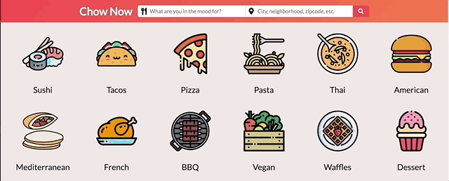
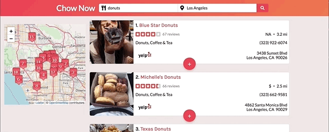
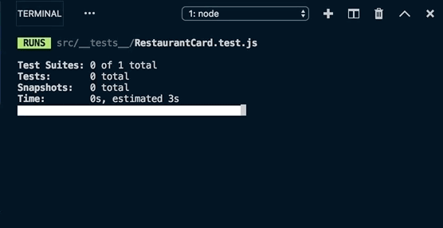

## Chow Now

**June 19, 2019**

We all know and love [Yelp](www.yelp.com). However, on a recent visit to the Yelp website, I noticed that the site was not responsive to viewport changes. Blocky elements simply overflowed beyond screen!

That got me thinking: Could I leverage the [Yelp Fusion API](https://www.yelp.com/fusion) and the much-hyped Hooks feature of React to create a responsive version of Yelp using the latest and greatest React tools? And could that code be tested using Kent C. Dodds' new and also much-hyped [React Testing Library](https://testing-library.com/docs/react-testing-library/intro)?

I was excited for the challenge. The outcome is [Chow Now](https://chow-now.netlify.com).

### APIs and Fetching With Hooks

#### Yelp Fusion

The good folks at Yelp have created a RESTful API called [Yelp Fusion](https://www.yelp.com/fusion) with several very useful endpoints. In this project, I employed three of them:

1. [Search](https://www.yelp.com/developers/documentation/v3/business_search) - to find businesses by keyword and location
2. [Business Details](https://www.yelp.com/developers/documentation/v3/business) - to fetch hours of operation for a selected business
3. [Reviews](https://www.yelp.com/developers/documentation/v3/business_reviews) - to fetch recent user reviews of a selected business

The API is publicly accessible after registering an account and obtaining an API key.

The API is designed for server-to-server communication, and client-side access raised some nasty CORS errors. As a workaround, I used [CORS Anywhere](https://github.com/Rob--W/cors-anywhere), a NodeJS reverse proxy that adds CORS headers to the data request, for client-side only access to the database. You simply prefix API URLs with `https://cors-anywhere.herokuapp.com/` to enable cross-domain requests.

#### Axios setup

I created a new instance of axios for Yelp Fusion that accounts for the static `baseURL` and `headers` properties of each API GET request.

**/apis/yelpapi.js**

<!-- prettier-ignore -->
```javascript
import axios from 'axios';

export default axios.create({
  baseURL: 'https://cors-anywhere.herokuapp.com/https://api.yelp.com/v3',
  headers: {
    Authorization: 'Bearer <your-api-key>'
  }
});
```

#### Fetching Searched Restaurants



<figcaption>Fetching list of restaurants by term and location</figcaption>

The Search endpoint in Yelp Fusion allows for users to query restaurants given a `term` and a `location`. The term can range from types of food to meal categories (e.g., tacos, pizza, breakfast, dinner, etc.). The location can be a city, neighborhood, zipcode, or latitude/longitude coordinates. Users also have an option to use their current location, which is obtained with the [navigator.geolocation](https://developer.mozilla.org/en-US/docs/Web/API/Navigator/geolocation) API.

The search form in the header controls all of the user input for the search parameters. Given non-empty form inputs, form submission triggers a redirect to a new page that renders the RestaurantList component. The URL is parsed via react-router's `match` prop to determine the search parameters:

- term
- location
- latitude
- longitude
- page

Either `location` or `latitude` and `longitude` coordinates are parsed, depending on whether the user entered a city name or used their current location, for example. Parsing and fetching from the URL allows for the component and page to stay in sync during refreshes.

The `useState` hook is used to store and modify three aspects of state that are local to `RestaurantList`:

1. The returned response of restaurants from the GET request
   - `const [restaurants, setRestaurants] = useState([])`
   - Initially set to an empty array
   - With a successful response, this will be an array of 20 restaurant objects
2. Whether the loading state is true or false during the fetching lifecycle
   - `const [isLoading, setIsLoading] = useState(false)`
   - Initially set to false
   - Will switch to true when the fetching begins, then back to false if no error occurs
3. Whether the error state is true or false during the fetching lifecycle
   - `const [isError, setIsError] = useState(false)`
   - Initially set to false
   - Will switch to true if an error is caught

The actual data fetching is performed in the `useEffect` hook. This hook take in two arguments: a callback function that returns the asynchronous data fetching function and an array of dependencies that enable a re-render when any of them change. Before Hooks, this type of re-rendering was accomplished with the `componentDidUpdate` lifecycle method. With Hooks, data can be fetched when the component first mounts and when props/state change in a single `useEffect` Hook.

In this case above, a new fetching of data should occur if the search term, location, latitude, longitude, or page changes. Thus, we'll have these five elements as dependencies to the fetching function inside of `useEffect`.

**/src/components/RestaurantList.js**

<!-- prettier-ignore -->
```javascript
import React, { useState, useEffect } from 'react';

import Loading from './Loading';
import Error from './Error';
import NoResults from './NoResults';

import { parseSearchParams } from '../helper';
import yelpapi from '../apis/yelpapi';

const RestaurantList = ({ match }) => {
  // Sync URL and UI through URL parameters
  const [term, location, latitude, longitude, page] = parseSearchParams(match);

  // State and effects for fetching the searched restaurants
  const [restaurants, setRestaurants] = useState([]);
  const [isLoading, setIsLoading] = useState(false);
  const [isError, setIsError] = useState(false);

  useEffect(() => {
    const fetchData = async () => {
      setIsLoading(true);
      setIsError(false);

      try {
        const response = await yelpapi.get('/businesses/search', {
          params: {
            term: term,
            location: location,
            latitude: latitude,
            longitude: longitude,
            offset: `${page * 20}`
          }
        });
        setRestaurants(response.data.businesses);
      } catch (error) {
        setIsError(true);
      }
      setIsLoading(false);
    };
    fetchData();
  }, [term, location, latitude, longitude, page]);

  if (isError) {
    return <Error />;
  }

  if (isLoading) {
    return <Loading />;
  }

  if (!isLoading && restaurants.length === 0) {
    return <NoResults />;
  }

  return (
      // List of RestaurantCard components
  );
};

export default RestaurantList;
```

As the state of `isLoading`, `isError` and `restaurants` change during the fetching lifecycle, either a loading dots spinner, an error message, or the list of restaurant cards appear on the page.

Functional stateful components with a single function to handle fetching during initial mounting and re-fetching during state changes?! Oh yes, I'm sold on the beauty of hooks.

#### Fetching Restaurant Details



<figcaption>Fetching hours and reviews of a restaurant</figcaption>

A similar process occurs when fetching the hours of operations and user reviews of a restaurant. The fetching is triggered by a click event on the red floating action button at the bottom of each restaurant card. This event passes a `showDetails` prop and a `restaurantID` prop down to the `RestaurantDetails` component, which handles the fetching and display of hours and reviews.

There are two minor differences in the fetching of hours/reviews compared to the fetching of searched restaurants:

1. Since hours of operation and user reviews are accessed by two different endpoints, two GET requests are executed instead of one.
2. Fetching should only happen on a click event, not when the component mounts. So a conditional clause must be included to trigger the fetching function.

Handling the first difference is simple enough, we just wait for two responses - one containing the hours and one containing the reviews - to be received before displaying the content.

Conditional fetching inside of `useEffect` is accomplished by including an if-statement that controls the calling of the fetching function inside of the hook's callback. If the user clicks the floating action button to show more details, then the `showDetails` prop toggles to `true`. And so long as the `hours` and `reviews` slices of state are also empty (i.e., we haven't already fetched details of this restaurant), then the fetching can proceed.

**/src/components/RestaurantDetails.js**

<!-- prettier-ignore -->
```javascript
const RestaurantDetails = ({ showDetails, restaurantID }) => {
  // Fetch hours and user reviews
  const [isLoading, setIsLoading] = useState(false);
  const [isError, setIsError] = useState(false);
  const [hours, setHours] = useState({});
  const [reviews, setReviews] = useState([]);

  useEffect(() => {
    const fetchHoursAndReviews = async () => {
      setIsLoading(true);
      setIsError(false);
      try {
        const responseHours = await yelpapi.get(`/businesses/${restaurantID}`);
        const responseReviews = await yelpapi.get(
          `/businesses/${restaurantID}/reviews`
        );
        setHours(responseHours.data.hours[0]);
        setReviews(responseReviews.data.reviews);
      } catch (error) {
        setIsError(true);
      }
      setIsLoading(false);
    };

    // Only fetch when details are requested
    // and hours/reviews are empty
    if (
      showDetails &&
      Object.keys(hours).length === 0 &&
      reviews.length === 0
    ) {
      fetchHoursAndReviews();
    }
  }, [restaurantID, showDetails, hours, reviews.length]);

  // Display hours and reviews
  // ...
```

Now, our `useEffect` callback function depends not only on the `restaurantID` and `showDetails` props, but also on the characteristics of the `hours` and `reviews` pieces of state. Hence, they're included as additional elements in the dependency array for this hook.

### Responsive Design

One of my primary motivations for creating Chow Now was to implement the core features of the Yelp website in a responsive fashion, which is lacking from the current site.

When a user searches for restaurants, an interactive map and a list of 20 restaurant cards are displayed. On larger screens, the map sticks to the top, left side of restaurant list and on smaller screens, the map is positioned on top of the list and can be scrolled out of view.

The restaurant card itself also changes shape on small screens. The initial information displayed in the card is a flexed div, where the flex-direction changes from columns for smaller screens to rows for larger screens. A few lines of CSS does the trick!

**/src/components/RestaurantCard.js**

<!-- prettier-ignore -->
```javascript
// Snippet showing horizontal to vertical responsive 
// alignment for card photo and information

import React from 'react';
import styled from 'styled-components';

const CardContainer = styled.div`
  .card__photo-info {
    display: flex;
    flex-direction: column;
  }

  @media screen and (min-width: 600px) {
    .card__photo-info {
      flex-direction: row;
    }
  }
`
const RestaurantCard = ({ index, restaurant }) => {
  
  // Fetch restaurant details
  // ...

  return (
    <CardContainer>
      <div className="card__photo-info">
        <CoverPhoto image_url={restaurant.image_url} />
        <RestaurantInfo
          index={index}
          restaurant={restaurant}
        />
      </div>
    </CardContainer>
  );
};
```


<figcaption>Layouts responding to screen width changes</figcaption>

### Testing Components with Jest and RTL

#### Motivation

Kent C. Dodds recently published a new testing library for React appropriately called React Testing Library (RTL). The motivation for doing so is worth stating here:

> The more your tests resemble the way your software is used,
> the more confidence they can give you.
> -Kent C. Dodds

RTL provides a handful of DOM querying tools that mimic the logic of a _user_, not a developer. And I think this makes sense. If we want to test the UI, we should place ourselves in the shoes of a user. The user doesn't care about class names, state, and props. The user cares about interacting with the app and seeing changes on the screen from those interactions. RTL makes it easy to think like a user while testing React components.

Jest pairs nicely with RTL by providing a rich assertion library, function/module mocking capabilities, and some custom DOM matchers that also come in handy.

#### Installation

Jest comes installed when bootstrapping a project with Create React App, as was used for Chow Now, so we only need to install RTL itself and the Jest-DOM extension package.

```
npm install --save-dev @testing-library/react
npm install --save-dev jest-dom
```

#### Mocking Axios

Before into the tests, we need to mock the axios library. Jest provides a nifty `genMockFromModule()` function to generate a mocked version of axios and allows for us to extend the mock's behavior. In our case, since we're using the `create` method of axios, we can manually mock that method in the mocked module, as seen below.

**/src/\_\_mocks\_\_/axios.js**

<!-- prettier-ignore -->
```javascript
const mockAxios = jest.genMockFromModule('axios');
mockAxios.create = jest.fn(() => mockAxios);

export default mockAxios;
```

#### Testing the Restaurant Card

To demonstrate the usefullness of RTL, we'll step through tests for the `RestaurantCard` component.

The following needs to be imported:

- React (of course!)
- Four named exports from RTL:
  - `cleanup` - unmounts React trees mounted by `render`
  - `fireEvent` - trigger DOM events
  - `render` - render a component in a new container, which is appended to `document.body`
  - `waitForElement` - asynchronous utility that waits for a DOM element to appear
- Helper functions, which can then be spied on
- The actual `axios` module, though it will be overwritten by the mocked version of it in /src/\_\_mocks\_\_/axios.js
- The `RestaurantCard` component itself

**/src/\_\_tests\_\_/.test.js**

<!-- prettier-ignore -->
```javascript
import React from 'react';
import {
  cleanup,
  fireEvent,
  render,
  waitForElement
} from '@testing-library/react';
import * as helper from '../helper';
import mockAxios from 'axios';

import RestaurantCard from '../components/RestaurantCard';
```

Next, fake response data is created that the mocked axios calls will return. It's important to make sure that the mocked data has the exact structure of the real data we'd expect from Yelp Fusion. Spies on the helper functions used in this component are also established.

<!-- prettier-ignore -->
```javascript
// Imports
// ...

// Set spies on helper functions used in this component
const mockGetStars = jest.spyOn(helper, 'getStars');
const mockDistanceInMiles = jest.spyOn(helper, 'distanceInMiles');
const mockGetOpenHours = jest.spyOn(helper, 'getOpenHours');
const mockFormatReviewDate = jest.spyOn(helper, 'formatReviewDate');

// Create mock index and restuarant data that RestaurantCard receives as props
const mockIndex = 1;
const mockRestaurant = {
  alias: 'dune-los-angeles',
  categories: [
    { alias: 'falafel', title: 'Falafel' },
    { alias: 'salad', title: 'Salad' }
  ],
  coordinates: { latitude: 34.1169649464573, longitude: -118.262093149437 },
  display_phone: '(323) 486-7073',
  //...
}

// Mock hours data coming in from axios call
const mockHours = {
  data: {
    hours: [
      {
        hours_type: 'REGULAR',
        is_open_now: true,
        open: [
          { is_overnight: false, start: '1000', end: '2200', day: 0 },
          { is_overnight: false, start: '1000', end: '2200', day: 1 },
          // ...
        ]
      }
    ]
  }
}

// Mock reviews data coming in from axios call
const mockReviews = {
  data: {
    reviews: [
      {
        id: 'XOufenw_mNLWlKAz0GPTeA',
        rating: 5,
        // ...
      }
    ]
  }
}
```

With all the mocked data and functions in place, we can begin the tests using the following steps:

1. Render the component using RTL's `render` function.
2. Destructure RTL's special DOM querying functions based on how the component/HTML is structured.

   - Querying through the lens of a user, for instance by text, label text, placeholder text, etc., is favored.
   - If no visible text exists, add a `data-testid` attribute to in the markup to query it by test id.
   - Alternatively, query a parent node and traverse the DOM to locate child nodes that are to be tested.

3. At least initially, also destructure the `debug` function from RTL that will display the markup wherever you are in the test.
4. Perform assertions with Jest.
5. Simulate events with the `fireEvent` RTL function.
6. Following the event, wait for new elements to appear in the DOM using the `waitForElement` RTL function.
7. Perform more assertions with Jest on the new elements.

When a card is initially rendered, it only shows the restaurant's details (name, rating, address, phone, etc.). Since a user sees those elements, we can query that text in the DOM. In cases where no clear text is available (for instance the Yelp star icons), a `data-testid` attribute can be added in the markup to then be queried.

<!-- prettier-ignore -->
```javascript
// Imports
// ...

// Mocked data/functions
// ...
describe('<RestaurantCard />', () => {
  test('card initially renders with overview details', () => {
    const { debug, getByText, getByTestId } = render(
      <RestaurantCard index={mockIndex} restaurant={mockRestaurant} />
    );

    // Assert that getStars and distanceInMiles helper
    // functions are each called once with restaurant properties
    expect(mockGetStars).toHaveBeenCalledTimes(1);
    expect(mockGetStars).toHaveBeenCalledWith(mockRestaurant);

    expect(mockDistanceInMiles).toHaveBeenCalledTimes(1);
    expect(mockDistanceInMiles).toHaveBeenCalledWith(mockRestaurant.distance);

    // Assert that restaurant name exists and has a link to Yelp page
    expect(getByText(mockRestaurant.name).textContent).toBe(
      `${mockIndex + 1}. ${mockRestaurant.name}`
    );
    expect(getByTestId('restaurant-link').href).toBe(mockRestaurant.url);
    expect(getByText(mockRestaurant.price).textContent);

    // Assert that the number of reviews is visible
    expect(getByTestId('review-count').textContent).toBe(
      `${mockRestaurant.review_count} reviews`
    );

    // Assert that restaurant address exists
    expect(getByTestId('restaurant-address').firstChild.textContent).toBe(
      mockRestaurant.location.address1
    );

    expect(
      getByTestId('restaurant-address').firstChild.nextSibling.textContent
    ).toBe(
      `${mockRestaurant.location.city}, ${mockRestaurant.location.state}${
        mockRestaurant.location.zip_code
      }`
    );

    // Assert that a button with "+" is visible initially
    expect(getByText('+')).toBeVisible;
  });

```

Next, we'll simulate a user clicking on the floating action button that should fetch the restaurant's hours of operation and user reviews. This test introduces two new querying functions `getAllByTestId` and `getAllByText`, which similar to `querySelectorAll()`, grabs all elements by a given `data-testid` attribute or text value.

Render the component and destructure the querying functions:

<!-- prettier-ignore -->
```javascript
test('hours and reviews render on button click', async () => {
    const {
      debug,
      getByText,
      getByTestId,
      getAllByTestId,
      getAllByText
    } = render(
      <RestaurantCard index={mockIndex} restaurant={mockRestaurant} />
    );

    // Assertion tests to follow
    // ...
```

Simulate a user clicking on the floating action button:

<!-- prettier-ignore -->
```javascript
// Assert that button text changes to "-" when clicked
fireEvent.click(getByText('+'));
expect(getByText('-')).toBeVisible;
```

Check that the loading dots appear before any new elements arrive:

<!-- prettier-ignore -->
```javascript
// Loading dots reappear while loading hours and reviews
expect(getByTestId('loading-dots')).toBeTruthy;
```

Bring in the fake data from mock axios GET requests:

<!-- prettier-ignore -->
```javascript
mockAxios.get.mockResolvedValueOnce(mockHours);
mockAxios.get.mockResolvedValueOnce(mockReviews);
```

Allow the second half of the card containing the hours/reviews details to appear:

<!-- prettier-ignore -->
```javascript
// Wait for details wrapper to appear
await waitForElement(() => getByTestId('restaurant-details'));
```

Ensure that the helper functions were called:

<!-- prettier-ignore -->
```javascript
expect(mockGetOpenHours).toHaveBeenCalled;
expect(mockFormatReviewDate).toHaveBeenCalled;
expect(mockGetStars).toHaveBeenCalled;
```

Assert that the mocked hours/reviews are displayed correctly:

<!-- prettier-ignore -->
```javascript

// Assert that either 'Open Now' or 'Closed' is visible
expect(
  mockHours.data.hours[0].is_open_now
    ? getByText('Open Now')
    : getByText('Closed')
).toBeVisible;

// Assert that all line items of restaurant hours match incoming data
expect(getAllByTestId('restaurant-hours-item').length).toBe(
  mockHours.data.hours[0].open.length
);

// Assert all user avatars are sourced from the correct URL
expect(getAllByTestId('review-user-avatar').map(user => user.src)).toEqual(
  mockReviews.data.reviews.map(review => review.user.image_url)
);

// Assert all user names appear in the review header
expect(
  getAllByTestId('review-user-name').map(user => user.textContent)
).toEqual(mockReviews.data.reviews.map(review => review.user.name));

// Assert that all links to the full review have correct URL
expect(getAllByText('Read full review').map(link => link.href)).toEqual(
  mockReviews.data.reviews.map(review => review.url)
);
```

Simulate clicking the floating action button again to hide the details:

<!-- prettier-ignore -->
```javascript
// Assert that details are hidden after button clicked again
fireEvent.click(getByText('-'));
expect(getByTestId('restaurant-details')).not.toBeVisible;
```



<figcaption>✅ ✅ 🚀</figcaption>
