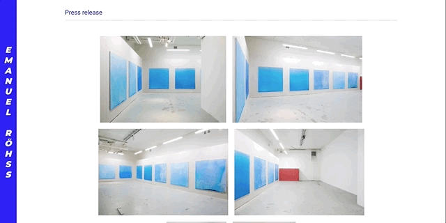

## Emanuel Röhss

**July 27, 2019**

Emanuel Röhss is an LA-based artist and was seeking a new design with high performance for his image-heavy online portfolio.

Given [Gatsby's image optimization features](https://www.gatsbyjs.org/docs/working-with-images/), [plugin ecosystem](https://www.gatsbyjs.org/plugins/) for sourcing 3rd party APIs, built-in [GraphQL interface](https://www.gatsbyjs.org/docs/querying-with-graphql/), and ability to seamlessly [deploy continuously on Netlify](https://www.gatsbyjs.org/docs/deploying-to-netlify/), it was an easy call to go with this framework for [Emanuel's site](https://emanuelrohss.com/).

### Airtable as a Headless CMS

[Airtable](https://guide.airtable.com/introduction-to-databases/) is a cloud-based database product allowing users to create custom relational tables and access its content via APIs. The free-tier option allows for 1,200 records and 2GB in the database, plenty for a personal project (even with dozens of large-sized images). The developer experience for Airtable is wonderful. It's easy to get a new database created, organized, and made accessible to your site. The following sections will cover all of these topics, and make sure you checkout the YouTube video below for additional knowledge.

 <iframe
  title="Use Airtable as a CMS for Gatsby — Learn With Jason"
  src="https://www.youtube.com/embed/x6IA6dfzlcQ" 
  style="border:none" 
  allow="fullscreen" 
  ></iframe>
<figcaption>Jason and Giovanni's Airtable + Gatsby tutorial. 10/10 recommend.</figcaption>

#### Database Schema

In the Portfolio database (or "base" in Airtable lingo), three tables are created that have links to each other:

1. Projects
2. Images
3. Videos

Each record in the Project base has the following fields:

- project title (string)
- project order (integer)
- slug (string)
- cover photo (attached jpeg/png)
- press release (attached PDF)
- Images (linked records from Images base)
- Videos (linked records from Videos base)

Each record in the Images base has the following fields:

- project (linked to a specified record in Projects base)
- image order (integer)
- attachment (attached jpeg/png)
- image title (string)
- image year (string)
- image view (string)
- image location (string)
- image materials (string)
- image dimensions (string)

The same schema exists for records in the Videos base, only with video order, video title, etc., as field names.

#### Connecting Airtable to Gatsby

Each base comes with a built-in API from Airtable along with custom documentation on how to access and query data from a given base. Authentication is token-based, using a `BASE_ID` and `API_KEY`. With those values in hand, we can install a Gatsby plugin called [gatsby-source-airtable](https://www.gatsbyjs.org/packages/gatsby-source-airtable/) that will enable GraphQL queries on the data in our Airtable bases.

The [gatsby-source-filesystem](https://www.gatsbyjs.org/packages/gatsby-source-filesystem/) plugin is also required for the Airtable sourcing to work when attachments are one of the fields in a table. Finally, we'll include the Sharp image-processing plugins for sleek blur-up and lazy-loading effects.

`npm install --save gatsby-source-filesystem`

`npm install --save gatsby-source-airtable`

`npm install --save gatsby-transformer-sharp gatsby-plugin-sharp`

The `dotenv` package is also installed so that the Airtable tokens can be stored in a `.env` file instead of directly in visible code.

`npm install dotenv`

Once all the packages are installed, the tables can be configured in the `gatsby-config.js` file:

**gatsby-config.js**

<!-- prettier-ignore -->
```javascript
require('dotenv').config()

module.exports = {
  plugins: [
    `gatsby-transformer-sharp`,
    `gatsby-plugin-sharp`,
    {
      resolve: `gatsby-source-filesystem`,
      options: {
        name: `assets`,
        path: `${__dirname}/src/assets`
      },
    },
    {
      resolve: `gatsby-source-airtable`,
      options: {
        apiKey: process.env.AIRTABLE_API_KEY,
        tables: [
          {
            baseId: process.env.AIRTABLE_BASE_ID,
            tableName: "Images",
            mapping: {attachment: `fileNode`},
          },
          {
            baseId: process.env.AIRTABLE_BASE_ID,
            tableName: "Videos",
            mapping: {attachment: `fileNode`},
          },
          {
            baseId: process.env.AIRTABLE_BASE_ID,
            tableName: "Projects",
            tableLinks: ["Images", "Videos"]
            mapping: {attachment: `fileNode`},
          },
 
        ]
      }
    }
  ]
}
```

Connecting each table to Gatsby requires its `baseId` (same for all tables in a given base), the `tableName`, and when using attachments, a specification that a node for each of these attached files should be created with the column name `fileNode`, which will then be used in Gatsby's Sharp image plugin (discussed in depth later on). Since the Images and Videos tables are linked to Projects, we also need to specifiy that information in the array value to the `tableLinks` property for the Projects table.

#### GraphQL Queries on Airtable Data

There are two primary queries of data from Airtable in this site:

1. The landing page that displays a title and cover photo for each project

   - Pulling project titles and cover photos from the Projects table

2. Specific project pages that include a gallery of images/videos for that project

   - Pulling linked images and videos from a specified project in the Project's table

The landing page query occurs in `src/pages/index.js` and uses the built-in `graphql` function from Gatsby. Exporting a graphql query in a Gatsby page component automatically inserts the result of the query as a `data` prop into the component.

Building the GraphQL query is easiest through the GraphiQL Explorer feature, accesible at `http://localhost:8000/___graphql`. One way to tap into the Projects table is by querying all tables in the base, filtering for "Projects", and sorting the projects in ascending order. Once inside the Projects table, we then traverse the nodes in that graph (i.e., each project) to retrieve corresponding cover photos, titles, press releases, and slugs.

**/src/pages/index.js**

<!-- prettier-ignore -->
```javascript
import React from 'react';
import { Link, graphql } from 'gatsby';
import Img from 'gatsby-image';
import styled from 'styled-components';

import Layout from '../components/layout';
import SEO from '../components/seo';

export const query = graphql`
  {
    allAirtable(
      sort: { order: ASC, fields: data___project_order }
      filter: { table: { eq: "Projects" } }
    ) {
      nodes {
        data {
          cover_photo {
            localFiles {
              childImageSharp {
                fluid(maxWidth: 800) {
                  ...GatsbyImageSharpFluid_withWebp
                }
              }
            }
          }
          project_title
          press_release {
            filename
            id
            url
          }
          slug
        }
        recordId
      }
    }
  }
`;

const IndexPage = ({ data }) => {
  // JSX for Index page
}

export default IndexPage;
```

Note how attached images are queried using ImageSharp nodes from the Sharp image processing library. We specify that each `cover_photo`, which is available on the `localFiles` node, is a fluid image that is responsive to its container up to a width of 800px and will blur-up to focus using [Webp](https://using-gatsby-image.gatsbyjs.org/prefer-webp/).

Since the contents of this query are injected into the component as a `data` prop, we can destructure that prop out and then access its nested properties in the JSX.

**/src/pages/index.js**

<!-- prettier-ignore -->
```javascript
import React from 'react'
import { Link, graphql } from 'gatsby'
import Img from 'gatsby-image'
import styled from 'styled-components

import Layout from '../components/layout'
import SEO from '../components/seo'

export const query = graphql`
  // GraphQL query from above
`;

const IndexPage = ({ data }) => {
  const renderCoverPhotoList = data.allAirtable.nodes.map(node => (
    <li className="project-item" key={node.recordId}>
      <Link className="project-item__link" to={`/${node.data.slug}`}>
        <h2 className="project-item__title">{node.data.project_title}</h2>
        
      </Link>
    </li>
  ))
  return (
    <Layout>
      <SEO title="Home" />
      <ProjectWrapper>
        <ul className="project-list">{renderCoverPhotoList}</ul>
      </ProjectWrapper>
    </Layout>
  )
}

const ProjectWrapper = styled.div`
  // CSS for the project wrapper
`
export default IndexPage;
```

The GraphQL query mimics the object structure of the response, making it very easy to know how to extract a given property. Also note how the Gatsby Image component, ``, is created by passing it an `alt` attribute equal to the cover photo's title and `fluid` attribute equal to the `fluid` property of that cover photo.

The end result is a landing page with a list of project title's and cover photos:


<figcaption>Project titles and blurred-up cover photos sourced from Airtable via GraphQL!</figcaption>

### Programmatically Creating Pages in Gatsby

#### Gatsby Node API

As referenced in the previous section, there's a second major query of data that happens in this site - the query used to generate individual project pages when a user clicks on any cover image on the landing page. This query and the process of creating new project pages requires the [Gatsby Node API](https://www.gatsbyjs.org/docs/node-apis/), which can be utilized in the `gatsby-node.js` file.

The key to this process is [createPages](https://www.gatsbyjs.org/docs/node-apis/#createPages) in the Gatsby Node API. This method tells plugins to add pages based on sourced nodes from Airtable (or any other data source). The two-step process is:

1. Source nodes from Airtable, where nodes are each project
   - Use the `graphql` method made available from the `createPages` API to grab the nodes
2. Map nodes to unique pages based on their slug and by providing a component template for all the content of that page
   - Use the `actions` method - an object containing functions - also made available from the `createPages` API to translate each node to a page

**gatsby-node.js**

<!-- prettier-ignore -->
```javascript
const path = require('path');

exports.createPages = async ({ actions, graphql }) => {

  // 1. Query project nodes from Airtable
  // Make sure to grab the slug, which is necessary
  // for the second step of defining a path
  const { data } = await graphql(`
    {
      allAirtable(
        filter: { table: { eq: "Projects" } }
        sort: { order: ASC, fields: data___project_order }
      ) {
        nodes {
          data {
            slug
            project_title
            press_release {
              url
            }
          }
        }
      }
    }
  `)

  // Extract the nodes and rename as projects
  const projects = data.allAirtable.nodes;

  // 2. Map each project to a new page
  projects.forEach((project, index) => {

    // Create next and previous propertyies that will be
    // passed along to each page for next/prev navigation
    const previous = index === projects.length - 1 ? null : projects[index + 1].data
    const next = index === 0 ? null : projects[index - 1].data

    // Create new pages by defining a path and component template
    // Share other properties via the context object
    actions.createPage({
      path: project.data.slug,
      component: path.resolve(`./src/templates/project-template.js`),
      context: {
        slug: project.data.slug,
        projectTitle: project.data.project_title,
        pressRelease: project.data.press_release[0].url,
        previous,
        next,
      },
    })
  })
}
```

#### Page Template Component

The second major query of data in this site occurs in `/src/templates/project-template.js`, which is trigged by a specific `slug` variable passed to the GraphQL query in the component template via the context object in `createPage` in `gatsby-node.js`. Content across the tables is filtered for where the `slug` field name equals the value of the `slug` variable passed to it. This allows us to retrieve just the images and videos for a given project on their unique pages.

**/src/templates/project-template.js**

<!-- prettier-ignore -->
```javascript
import React from 'react'
import { graphql, Link } from 'gatsby'

// Filter by project slug variable
export const query = graphql`
  query($slug: String!) {
    allAirtable(filter: { data: { slug: { eq: $slug } } }) {
      nodes {
        data {
          Images {
            data {
              dimensions
              view
              image_title
              location
              materials
              year(formatString: "YYYY")
              attachment {
                localFiles {
                  childImageSharp {
                    fluid(maxWidth: 960) {
                      ...GatsbyImageSharpFluid_withWebp
                      aspectRatio
                    }
                  }
                }
              }
            }
            id
          }
          Videos {
            data {
              attachment {
                localFiles {
                  url
                }
              }
              video_title
              year(formatString: "YYYY")
              materials
              length
              dimensions
            }
          }
        }
      }
    }
  }
`

const ProjectTemplate = props => {
  // Extract image and video nodes from Airtable
  const images = props.data.allAirtable.nodes[0].data.Images
  const videos = props.data.allAirtable.nodes[0].data.Videos

  // Remaining JSX
}

export default ProjectTemplate;

```

The code snippet above shows how all the sourced data from Airtable is on the `data` property on the components `props`. Additionally, all properties from the context object passed to this page can be accessed by the `pageContext` property, for instance, `props.pageContext.pressRelease`.

### Image Gallery and Modal Carousel

#### Flexbox gallery

When a user enters into a project page, a gallery appears that contains small previews of each image for that project. There are two major components to building this gallery:

1. Enforcing a uniform height of each gallery image while preserving the image ratio
2. Creating a responsive container so that images resize and flow naturally within the gallery based on viewport size

Luckily, image aspect ratios are accessible by including the `aspectRatio` property in the GraphQL query via the Sharp image processing package. This can be seen in the previous section's GraphQL query for images in `project-template.js`.

After extracting the image nodes from the GraphQL query, we map each image into a container with a fixed height and varying width based on the image's aspect ratio. I chose a height 250px for larger screens, which changes to 100% width on small screens, which seemed to create a nicely responsive gallery for a range of viewports.

**/src/templates/project-template.js**

<!-- prettier-ignore -->
```javascript
import React from 'react'
import { graphql, Link } from 'gatsby'
import Img from "gatsby-image"
import styled from "styled-components"

export const query = graphql`
  // GraphQL query as seen above
  // Response is injected as a 'data' prop into component
`

const ProjectTemplate = props => {

  // Extract images from data prop
  const images = props.data.allAirtable.nodes[0].data.Images;

  // Map images into an ImageCard with fixed heights of
  // 150px for small screens and 250px for larger screens
  // and variable widths based on image aspect ratio
    const renderImageList = images.map(image => {
    const aspectRatio = image.data.attachment.localFiles[0].childImageSharp.fluid.aspectRatio
    const widthSmall = 150 * aspectRatio
    const widthLarge = 250 * aspectRatio

    return (
      <ImageCard
        className="image-card"
        widthSmall={widthSmall}
        widthLarge={widthLarge}
        key={image.id}
        data-id={image.id}
      >
        <figure className="image">
          
        </figure>
      </ImageCard>
    )
  })

  return (
    <>
      // Additional JSX
      <section className="image-list">
        {renderImageList}
      </section>
    </>
  )

const ImageCard = styled.div`
  width: 100%;
  height: auto;
  display: inline-block;
  margin-bottom: 4rem;
  cursor: zoom-in;

  @media screen and (min-width: 800px) {
    height: 250px;
    width: ${props => props.widthLarge}px;
    margin: 0.5rem;
  }
`
```

Using styled-components, we pass down `widthLarge` to the `ImageCard` component, which sets the card's width based on screensize with a breakpoint at 800px.

With each image now created with standardized heights, only a few lines of CSS are needed on the overall gallery (i.e. `<section className="image-list">`) to have the images flow nicely:

<!-- prettier-ignore -->
```css
.image-list {
  display: flex;
  min-height: 200px;
  flex-wrap: wrap;
  justify-content: center;
}
```

Flexbox is a perfect tool for this feature. We only need to define a minimum height on the section and tell the flexed container to wrap children elements to new rows when they can no longer fit on a single row. Lastly, all content inside of the flexed container is centered along the main axis (rows in this case) using `justify-content: center`.


<figcaption>Responsive image gallery using flexbox</figcaption>

#### Portals in Gatsby/React

We also wanted users to have the ability to click on an image in the gallery to reveal a close-up version of that image inside of a modal. Once inside the modal, the close-up image is in fact one item of an infinite carousel that users can click/swipe through.

[Portals](https://reactjs.org/docs/portals.html) are required in React apps to render a component (e.g., a Modal) that is _not_ mounted into the DOM as a child of the nearest parent node. For instance, we'll want to use a Portal to mount a modal component atop the DOM node heirarchy so that it can be displayed on top of the entire app and not be "stuck" inside of a nearest parent container.

Portals require a new div to be created in the `index.html` file as a sibling to the overall app container. However, Gatsby builds the `index.html` file when generating the site - unlike the case of bootstrapping a React app with create-react-app - so we can't manually insert a new div element for the portal. No fear, there's a plugin to accomplish this called [gatsby-plugin-portal](https://www.gatsbyjs.org/packages/gatsby-plugin-portal/), which can be installed with:

`npm install --save gatsby-plugin-portal`

and configured in `gatsby-config.js` according to the documentation. The docs also provide the JSX for a reusable Portal component, which is used in this site too.

In the end, the DOM looks like:

```
html
  head
  body
    div#___gatsby (where main Gatsby app lives)
    div#portal (where children of the Portal get mounted)

```

Now the generic Portal component can be included in each project page, which receives a child Modal component that is opened by clicking on any gallery image.

**src/templates/project-template.js**

<!-- prettier-ignore -->
```javascript
import React from 'react';

import Layout from '../components/lauyout";
import Portal from '../components/Portal";
import Modal from '../components/Modal";

// GraphQL query as discussed above
// ...

const ProjectTemplate = props => {
  return (
    <>
      <Layout>
        // Additional JSX for project pages
      </Layout>
      <Portal>
        <Modal />
      </Portal>
    </>
  )
};

export default ProjectTemplate;

```

#### Modal Component

The Modal component is passed 3 props that are maintained by local state inside of the `project-template` component:

1. `showModal` - boolean (initially false) indicating whether the Modal should be shown or not
2. `setShowModal` - a function controlling the value of showModal
3. `modalImages` - an array (initially empty) of images for a given project that will be shown in the carousel of the modal

When a user clicks on a gallery image, `showModal` is set to `true` via `setShowModal` and the array of gallery images is re-ordered so that the clicked image comes first. These re-ordered images are then set to be `modalImages`. All of this happens on a click event attached to the `section` containing the gallery, which is delegated to child images in the section.

The Modal is comprised of 5 elements:

1. An overall container
2. A semi-transparent backdrop
3. A carousel wrapper/card
4. The Carousel component
5. Close button

**/src/components/Modal.js**

<!-- prettier-ignore -->
```javascript
import React from 'react';
import styled from 'styled-components';

import Carousel from './Carousel';

const Modal = ({ showModal, setShowModal, modalImages }) => {

  return (
    <div className="container">
      <div 
        className="backdrop" 
        aria-modal="true" 
        role="dialog" 
        onClick={e => {
          if (e.target.classList.contains('backdrop')) {
            setShowModal(false);
          }
        }}>
        <div className="card">
          <Carousel modalImages={modalImages} />
          <div>
            <button 
              className="card__button"
              onClick={() => setShowModal(false)}
            >
            Close
            </button>
          </div>
        </div>
      </div>
    </div>
  )
}
```

The backdrop is fixed to the upper left corner, spans the entire screen, and centers its children elements (the Carousel component):

<!-- prettier-ignore -->
```css
// Styling for backdrop portion of the Modal component

.backdrop {
  position: fixed;
  left: 0;
  top: 0;
  width: 100%;
  height: 100vh;
  z-index: 200;
  display: flex;
  justify-content: center;
  align-items: center;
  background-color: rgab(0, 0, 0, 0.85);
  overflow: hidden;
}
```

#### Carousel Component

The Carousel component is made possible thanks to the nifty [react-swipe](https://www.npmjs.com/package/react-swipe) package, which provides a component named `ReactSwipe` that allows users to swipe to next/previous items based on an array of children items in the component. In our case, `modalImages` are these children items, which are passed a prop to `Carousel.js` from `Modal.js`, as seen in the code snippet above. The react-swipe docs provide an excellent example for how to wire up the component, and I only slightly modified it for our purposes here:

**/src/components/Carousel.js**

<!-- prettier-ignore -->
```javascript
import React, { useEffect, useRef } from "react"
import ReactSwipe from "react-swipe"

const Carousel = ({ modalImages }) => {
  let reactSwipeEl

  // Create images with captions that will displayed on hover
  const images = modalImages.map(image => (
    <figure key={image.id}>
      <div>
         reactSwipeEl.next()}
        />
        <figcaption>
          <p>{image.title}</p>
          <p>{image.year}</p>
          <p>{image.materials}</p>
          <p>{image.view}</p>
          <p>{image.location}</p>
          <p>{image.dimensions}</p>
        </figcaption>
      </div>
    </figure>
  ))

  return (
    <CarouselContainer>
      <button onClick={() => reactSwipeEl.prev()}>
        Previous
      </button>
      <ReactSwipe
        childCount={images.length}
        swipeOptions={{}}
        ref={el => (reactSwipeEl = el)}
      >
        {images}
      </ReactSwipe>
      <button onClick={() => reactSwipeEl.next()}>
        Next
      </button>
    </CarouselContainer>
  )
}
```

On a desktop, users can navigate through the carousel by clicking on the previous or next buttons, which trigger a click event to built-in `prev()` and `next()` methods on the react-swipe element.

One last feature we wanted to implement on the carousel was the ability to also navigate to previous/next images using the left and right arrow keys, respectively. Accomplishing this is a two-step process:

1. Create a Ref to the Carousel container that can be focused when the component mounts
2. Attach key down events to the container that trigger the built-in `prev()` and `next()` methods when the left or right arrow is pressed.

**/src/components/Carousel.js**

<!-- prettier-ignore -->
```javascript
import React, { useEffect, useRef } from "react"
import ReactSwipe from "react-swipe"

const Carousel = ({ modalImages }) => {

  // Focus <CarouselContainer> on mount to allow for
  // arrow left and arrow right keys to toggle images
  const carouselRef = useRef(null)
  useEffect(() => {
    carouselRef.current.focus()
  }, [])
  
  let reactSwipeEl

  // Create images with captions that will displayed on hover
  const images = modalImages.map(image => (
    <figure key={image.id}>
      <div>
         reactSwipeEl.next()}
        />
        <figcaption>
          <p>{image.title}</p>
          <p>{image.year}</p>
          <p>{image.materials}</p>
          <p>{image.view}</p>
          <p>{image.location}</p>
          <p>{image.dimensions}</p>
        </figcaption>
      </div>
    </figure>
  ))

  return (
    <CarouselContainer
      ref={carouselRef}
      tabIndex="0"
      onKeyDown={e => {
        if (e.key === "ArrowLeft") {
          reactSwipeEl.prev()
        } else if (e.key === "ArrowRight") {
          reactSwipeEl.next()
        }
      }}
    >
      <button onClick={() => reactSwipeEl.prev()}>
        Previous
      </button>
      <ReactSwipe
        childCount={images.length}
        swipeOptions={{}}
        ref={el => (reactSwipeEl = el)}
      >
        {images}
      </ReactSwipe>
      <button onClick={() => reactSwipeEl.next()}>
        Next
      </button>
    </CarouselContainer>
  )
}
```

Voilà!



<figcaption>Swipeable carousel of project images</figcaption>
