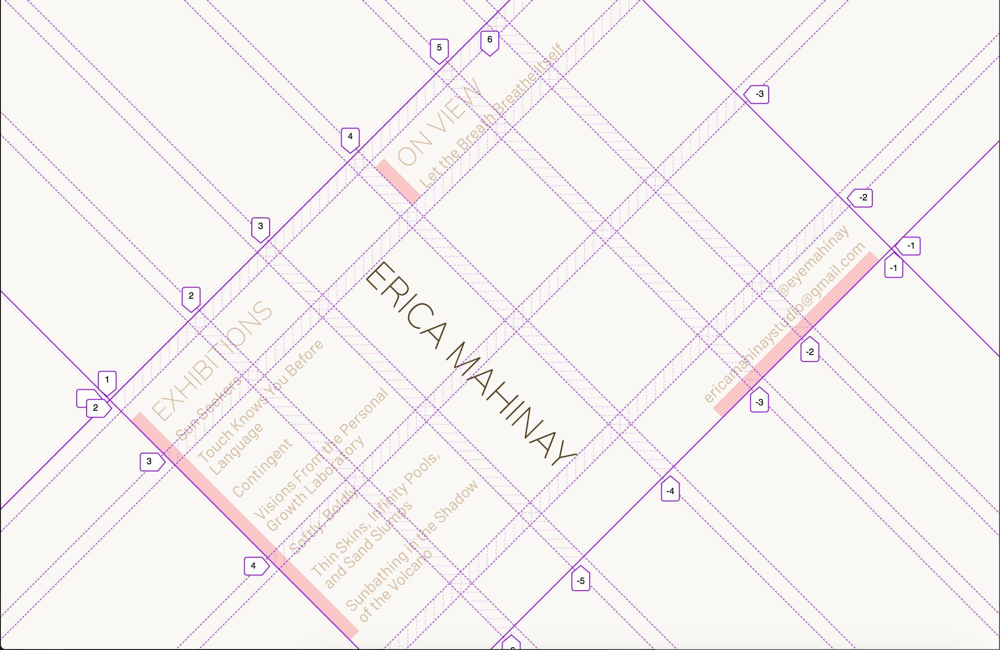
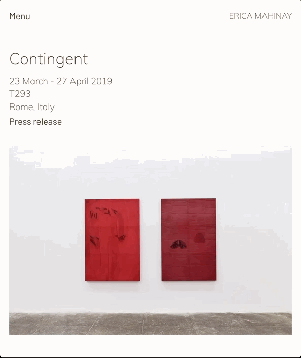

## Erica Mahinay

<time datetime="2019-09-22">September 22, 2019</time>

With so many content management options these days, it's hard to know which platform to select. Gatsby's [content mesh architecture](https://www.gatsbyjs.org/blog/2018-10-04-journey-to-the-content-mesh/) and plugin ecosystem makes it seamless and enjoyable to work with a host of systems. One of the most popular is [Contentful](https://www.contentful.com/). With a nice UI for uploading and editing content, a great [source plugin](https://www.gatsbyjs.org/packages/gatsby-source-contentful/) to Gatsby, and a generous free entry package, Contenful fast became one of my favorite tools for content management. Alongside unique grid-based responsive designs and spring-based animations, the result is a sleek, modern-day portfolio for the LA-based artist, [Erica Mahinay](https://ericamahinay.studio/).

### CSS Grid Landing Page

[Jen Simmons](https://labs.jensimmons.com/) has one of my favorite personal sites out there. The gridded landing page that responsively generates new layouts is a true gem and I wanted to incorporate a similar feature on Erica's site.

#### Large screens

A rotated grid paired with a vertical text header in the grid provides a striking container to house the landing page elements.



<figcaption>Grid for the landing page on larger screens</figcaption>

The JSX behind the grid is a container for the following four grid-items:

1. Exhibitions currently on view
2. Past exhibitions
3. Name
4. Contact information

**src/pages/index.js**

<!-- prettier-ignore -->
```js
const IndexPage = () => {
  // ... fetch Contentful data
  
  return (
    <div className="grid">
      <h1 className="name">Erica Mahinay</h1>
      <div className="exhibition-list">
         //... list of past exhibitions
      </div>
      <div className="onview-list">
         //... list of exhibitions on view
      </div>
      <div className="contact">
         //... contact information
      </div>
    </div>
  )
}
```

And the corresponding CSS to achieve the rotated grid:

```css
.grid {
  width: 66vw;
  margin: auto;
  transform: rotate(-45deg);
  display: grid;
  grid-template-columns: 1fr 0.75fr 1fr 1fr 0.5fr 1fr;
  grid-template-rows: auto 1fr auto auto 0.5fr;
}
```

Each of the direct children to `.grid` become grid-items and are positioned by axes indices using `grid-column` and `grid-row`.

The name header is placed near the middle of the 6-column grid with its text displayed vertically:

```css
.name {
  grid-column: 3 / 4;
  grid-row: 3 / 5;
  writing-mode: vertical-lr;
  justify-self: center;
}
```

The past exhibition list is flush with the leading two columns of the grid and claims all rows in those columns.

```css
.exhibition-list {
  grid-column: 1 / 3;
  grid-row: 1 / 5;
  align-self: center;
}
```

The grid's top right corner is reserved for exhibitions currently on view:

```css
.onview-list {
  grid-column: 4 / 7;
  grid-row: 2;
  align-self: end;
}
```

Finally, contact information is tucked in the lower right of the grid:

```css
.contact {
  grid-column: 4 / 7;
  grid-row: 5;
  align-self: end;
}
```

#### Small screens

For screens below 700px, the grid unrotates and morphs dimensions from [6 X 5] to [3 X 2] to more naturally align with vertical mobile viewports.


<figcaption>Changing grid dimensions for smaller devices</figcaption>

Then, each grid-item receives a new placement in the updated grid. The name and contact information are pinned to the right column with the exhibitions to the left column.

<!-- prettier-ignore -->
```css
.name {
  grid-column: 2;
  grid-row: 1 / 3;
  writing-mode: vertical-lr;
  justify-self: end;
  text-transform: uppercase;
}

.contact {
  grid-column: 1 / 3;
  grid-row: 3;
  justify-self: end;
  text-align: right;
  margin-right: 1rem;
}

.onview-list {
  grid-column: 1;
  grid-row: 1;
  align-self: end;
}

.exhibition-list {
  grid-column: 1;
  grid-row: 2;
}
```

### Spring-based animations

I've been diving into [react-spring](https://www.react-spring.io/) during recent projects for creating realistic animations based on physics and the motion of springs. A custom hook `useSpring` is provided by the package to quickly configure animated values, where the animation can be controlled by state in the component. This technique is employed to toggle visibility of the mobile nav when the menu button is clicked.

The `useSpring` hook and the `animated` tag wrapper are first imported from `react-spring`. We then setup a slice of state called `isMenuOpen`, which is toggled by the corresponding setter function `setIsMenuOpen`, and initially set to `false`. The `animation` props are then created using `useSpring`, which are distributed among an HTML element via the `style` prop.

<!-- prettier-ignore -->
```js
import React, { useState } from 'react;
import { useSpring, animated } from 'react-spring';

const MobileNav = () => {

  // Track status of menu open/close for spring animation
  const [isMenuOpen, setIsMenuOpen] = useState(false);

  // Setup the zoom-in animation 
  const animation = useSpring({
    transform: isMenuOpen
      ? `translate3d(0,0,0) scale(1)`
      : `translate3d(-100%,0,0) scale(0.6)`,
  })

  return (
    <div>
      <nav style={animation}>
        // ...Nav items
      </nav>
      <button onClick={() => setIsMenuOpen(!isMenuOpen)}>
    </div>
  );

}
```

When `isMenuOpen` turns `true`, the nav element translates horizontally and scales up into the full viewport.



<figcaption>Smoothly animating nav visibility</figcaption>

### Contentful CMS

#### Configuring Contentful for Gatsby

Gatsby sites can seamlessly work with Contenful through its [source plugin](https://www.gatsbyjs.org/packages/gatsby-source-contentful/). After installing it:

`npm i gatsby-source-contentful`,

it can be configured in the `gatsby-config.js` file.

<!-- prettier-ignore -->
```js
require('dotenv').config()

module.exports = {
  plugins: [
    {
      resolve: `gatsby-source-contentful`,
      options: {
        spaceId: process.env.CONTENTFUL_SPACE_ID,
        accessToken: process.env.CONTENTFUL_ACCESS_TOKEN,
        downloadLocal: true,
      },
    }
  ]
}
```

`CONTENTFUL_SPACE_ID` and `CONTENTFUL_ACCESS_TOKEN` values are provided by Contentful after you initialize a new space on its platform. I also included the `downloadLocal` property so that images would be locally available and sourced into Gatsby images within the site's image detail modal.

#### Fetching Contentful Data

6 content models are built for the site:

1. Blog Post
2. CV
3. Exhibition
4. Image
5. Video
6. Press

Each of them structures how user-input is collected and validated. Contentful's UI is nice to engage with and allows for highly customized formatting. Each model is made available as a node in Gatsby's GraphQL interface.

#### Static Queries

Gatsby's `useStaticQuery` hook is used on GraphQL queries that do not require input variables, such as grabbing all of the press articles to display on the press page.

**src/pages/press**

<!-- prettier-ignore -->
```js
import React from 'react'
import { graphql, useStaticQuery } from 'gatsby'

const Press = () = { 
  const data = useStaticQuery(graphql`
    {
      allContentfulPress(sort: { fields: order, order: DESC }) {
        nodes {
          id
          date
          title
          attachment {
            file {
              url
            }
          }
          link
        }
      }
    }
  `)

  const pressItems = data.allContentfulPress.nodes
  
  return (
    // ... render press items
  )
}
```

#### Dynamic queries

Exhibition pages are dynamically created in `gatsby-node.js` by sourcing all exhibition entires in Contentful. The page component is passed an `exhibitionTitle` value in the page's context. This string is then used to source all the images (stored in the Image model) associated with that exhibition.

**src/templates/exhibition-template.js**

```js
import React from "react"
import { graphql } from "gatsby"
import Img from "gatsby-image"

export const query = graphql`
  query($exhibitionTitle: String!) {
    allContentfulImage(
      filter: { exhibition: { eq: $exhibitionTitle } }
      sort: { fields: order, order: ASC }
    ) {
      nodes {
        dimensions
        id
        title
        year
        imageFile {
          fluid(maxWidth: 600) {
            ...GatsbyContentfulFluid_withWebp
          }
        }
        materials
      }
    }
  }
`

return (
  // ... exhibition information and images
)
```

Contentful makes available an `imageFile` property that syncs with Gatby's image component for sleek, blurred-up image rendering. When a `query` variable is exported from a Gatsby page, it makes available a `data` prop to that component containing the GraphQL query result. For instance, to render Gatsby Images beneath the query noted above, it would take the form:

```javascript
const images = props.data.allContentfulImage.nodes

const renderImages = images.map(image => (
  
)

return (
  // ...exhibition information
  <div>{renderImages()}</div>
)
```

Overall, the integration of Contenful data with Gatsby's GraphQL interface is a winning combination for speed, security, and developer happiness 😄.
