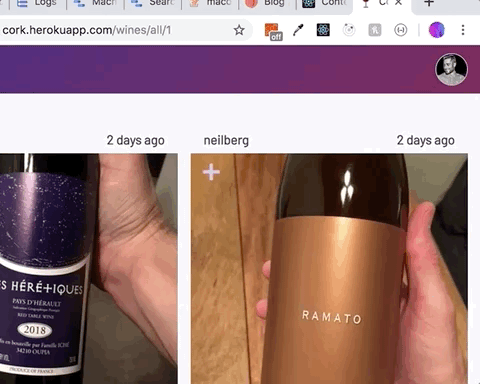

## Cork

<time datetime="2019-10-21">October 21, 2019</time>

Lately I've been enjoying natural wines. Natural wines are generally organic, biodynamic, and are made without additives. I would frequently take pictures of the bottles that I drank and enjoyed. However, those photos would quickly get lost in my overall photo library. I decided to build a web app with an Express server, Mongo database, and React frontend to create, upload, and interact with wines that users drink. Pop open a bottle and let [Cork](https://cork.herokuapp.com/) remember it!

### Backend

Cork is built on a Node/Express server connected to a Mongoose-driven Mongo database. The backend is divided into four main categories:

- Database - Mongoose logic for connecting to a MongoDB
- Models - schema for user and wine models
- Middleware - logic for authenticated routes and image uploads
- Routers - API endpoints for CRUD operations on users and wines

#### Database

A MongoDB can be spun up quickly using the `mongoose.connect()` method. We only need to supply the method with a MongoDB URL - either for a local database running on your machine for development or a remote/cloud hosted database (e.g. on [Mongo Atlas](https://www.mongodb.com/cloud/atlas)) for production. Locally, the DB runs on port 27017 and I named it `cork-api`. Thus, the `MONGODB_URL` (set as an environmental variabale) equals `mongodb://127.0.0.1:27017/cork-api`, which can be passed into `mongoose.connect()` to get our DB up and running locally.

**src/db/mongoose.js**

<!-- prettier-ignore -->
```javascript
const mongoose = require('mongoose');

mongoose.connect(process.env.MONGODB_URL, {
  useNewUrlParser: true,
  useCreateIndex: true,
});
```

In production, `MONGODB_URL` should reflect the URL for wherever the DB will be hosted publicly. If using Mongo Atlas, creating a multi-server cluster to host the DB on the cloud will return a new URL that should be the value to `MONGODB_URL`. This environmental variable can be injected into the app via Heroku, for example, or another hosting platform for the app.

#### Models

Two objects are modeled in Cork: users and wines. Creating a model in Mongoose is performed in two steps:

1. Define the schema and optionally, any validation
2. Compile the model from schema definitions and specify a collection name for the model

**src/models/user.js**

<!-- prettier-ignore -->
```javascript
const mongoose = require('mongoose');

// The wine model is imported to reference it in "likedWines"
const Wine = require("./wine");

// Step 1. Define the schema for a user
const userSchema = new mongoose.Schema(
  {
    name: {
      type: String,
      required: true,
      trim: true,
    },
    username: {
      type: String,
      required: true,
      trim: true,
      unique: true,
    },
    email: {
      type: String,
      required: true,
      lowercase: true,
      trim: true,
      unique: true,
    },
    password: {
      type: String,
      required: true,
      trim: true,
    },
    avatar: {
      type: Buffer,
    },
    tokens: [
      {
        token: {
          type: String,
          required: true,
        },
      },
    ],
    likedWines: [
      {
        type: mongoose.Schema.Types.ObjectId,
        ref: "Wine",
      },
    ],
  },
  {
    timestamps: true,
  }
);

// Step 2: Compile the model and assign a "User" collection name
const User = mongoose.model('User', userSchema);

module.exports = User;
```

Note how Mongoose allows for references to documents in other collections with the `ref` property. For instance, when a user likes a wine, that wine's `ObjectId` is concatenated to the `likedWines` array in that user's document. That references a single wine document, which can be populated with information using the [populate](https://mongoosejs.com/docs/populate.html) method.

The `Wine` model is very similarly structured with properties like `owner` (reference to the `User` document), `name`, `rating`, `type` and so forth.

#### Middleware

Two pieces of middleware are created for this app:

1. Authenticated API routes
2. Handling image uploads

First, an `auth` middleware is used to protect API routes for authenticated users only. This middleware parses the JSON web token attached to the HTTP request, decodes it, finds the user in the DB, and if successful, attaches the `token` and `user` properties to the request body object for remaining logic in that API endpoint to access.

**src/middleware/auth.js**

<!-- prettier-ignore -->
```javascript
const jwt = require('jsonwebtoken');
const User = require('../models/user');

// Find user by token, then add on token
const auth = async (req, res, next) => {
  try {
    const token = req.header('Authorization').replace('Bearer ', '');

    const decoded = jwt.verify(token, process.env.JWT_SECRET);

    // Find user by unique ID and a valid/unexpired token
    const user = await User.findOne({
      _id: decoded._id,
      'tokens.token': token
    });

    if (!user) {
      throw new Error();
    }

    // Successfully found user with valid token
    // Add on this token and user to req body
    req.token = token;
    req.user = user;
    next();
  } catch (error) {
    res.status(401).send({ error: 'Please authenticate' });
  }
};

module.exports = auth;
```

In the next subsection, we'll see how this `auth` middleware can be inserted into the request/response cycle for protecting routes.

The other piece of custom middleware used in Cork is for handling uploaded images of wines. This comes from the [multer](https://github.com/expressjs/multer) library that handles `mutipart/form-data` values in a form submission, i.e. image files. The middleware performs two checks:

1. Filesize must be below 15 MB (MongoDB limit)
2. File type must be a JPEG or PNG

If these two checks pass, then the image uploaded logic continues, otherwise an error is returned.

**src/middleware/uploads.js**

<!-- prettier-ignore -->
```javascript
const multer = require('multer');

const upload = multer({
  limits: {
    fileSize: 15000000 // 15 MB
  },
  fileFilter(req, file, cb) {
    if (!file.originalname.toLowerCase().match(/\.(jpg|jpeg|png)$/)) {
      return cb(new Error('Only JPG, JPEG, and PNG files are allowed'));
    }

    cb(undefined, true);
  }
});

module.exports = upload;
```

#### Routers

The API is divided into `users` and `wines` routes allowing CRUD operations on those objects. As one example, let's step through the backend logic for first creating a user and then uploading a new wine by that user.

Creating a user is done through a POST request to `/api/users`. The request's body contains an object with the user's name, username, email, and password, e.g.

<!-- prettier-ingore -->

```javascript
// Request body to /api/users
{
  name: 'Jane Doe',
  username: 'jdoe',
  email: 'jane@example.com'.
  password: 'pass1234!'
}
```

When `/api/users` is reached, a new instance of the `User` model is created with the content of the request's body object. Then a special [instance method](https://mongoosejs.com/docs/api.html#schema_Schema-method) is called on the fresh user instance to generate a JSON web token and concatenate it onto the user's `tokens` property. A 201 (created) response is sent back to the client with the user and token, which is then stored in the browser for subsequent authenticated-only API calls with the token in the request header.

**src/routers/userRouter.js**

<!-- prettier-ignore -->
```javascript
const express = require('express');

const User = require('../../User');

const router = new express.Router();

router.post('/api/users', async (req, res) => {
  const user = new User(req.body);
  try {
    const token = await user.generateAuthToken();
    await user.save();
    res.status(201).send({ user, token });
  } catch (error) {
    res.status(400).send();
  }
});
```

A new JSON web token is generated each time a new user is created through the `generateAuthToken()` instance method on the `User` model.

**src/models/user.js**

<!-- prettier-ignore -->
```javascript
const mongoose = require('mongoose');
const jwt = require('jsonwebtoken');

const userSchema =  new mongoose.Schema({
  // Schema as defined in previous section
});

// Generate new JWT when user is created from POST /api/users
// and concatenate this new JWT to the user's tokens property
userSchema.methods.generateAuthToken = async function() {
  const user = this;
  const token = jwt.sign({ _id: user._id.toString() }, process.env.JWT_SECRET, {
    expiresIn: '7 days'
  });
  user.tokens = user.tokens.concat({ token });
  await user.save();
  return token;
};
```

Note how we are sending the `user` in the response when they are created. To prevent the user's password from being exposed in the response, we create one more instance method on the `User` model that strips out the password property whenever `user` is sent in a response.

**src/models/user.js**

<!-- prettier-ignore -->
```javascript
const mongoose = require('mongoose');

const userSchema = new mongoose.Schema({
  // schema as defined in previous section
});

userSchema.methods.generateAuthToken = async function() {
  // as defined above
}

// Strip out password and token from user response object
userSchema.methods.toJSON = function() {
  const user = this;
  const userObject = user.toObject();

  delete userObject.password;
  delete userObject.tokens;
  delete userObject.avatar;

  return userObject;
};
```

Finally, we ensure that a plaintext password is never stored in the DB, but instead strongly hashed and encrypted with the `bcryptjs` library. The hashing logic takes place in a Mongoose middleware "hook" before any `save()` call is executed. For instance, just before saving a user (`await user.save()`), a `pre` hook is used to hash the password before it gets saved in the DB.

**src/models/user.js**

<!-- prettier-ignore -->
```javascript
const mongoose = require('mongoose');
const bcrypt = require('bcryptjs');

const userSchema = new mongoose.Schema({
  // schema as defined in previous section
});

userSchema.methods.generateAuthToken = async function() {
  // as defined above
}

userSchema.methods.toJSON = function() {
  // as defined above
};

// Before saving user (newly created or updated), hash their password
userSchema.pre('save', async function(next) {
  const user = this;

  // Only perform hashing if password on the user has been modified (or new)
  if (user.isModified('password')) {
    user.password = await bcrypt.hash(user.password, 8);
  }

  next();
});

const User = mongoose.model('User', userSchema);

module.exports = User;
```

Once a user is successfully created, they'll have a JSON web token stored locally that is attached as a header in any request needing authentication.

For example, when a user creates a new wine, first the `auth` middleware is run that checks for a valid token in the request header and attaches user information to the request body. Then, a new instance of the `Wine` model is created with the wine's owner being a reference the user's `ObjectId`.

**src/routers/wineRouter.js**

<!-- prettier-ignore -->
```javascript

const express = require('express');

const auth = require('../middleware/auth');
const Wine = require('../models/wine');

const router = new express.Router();

router.post('/api/wines/', auth, async (req, res) => {
  // req.user is accessible via the auth middleware
  const wine = new Wine({ ...req.body, owner: req.user._id });
  try {
    await wine.save();
    res.status(201).send(wine);
  } catch (error) {
    res.status(400).send(error);
  }
});
```

### Frontend

Cork is written entirely in functional components thanks to the new hooks in React. Previous posts have discussed `useState` and `useEffect`, so for this section I'd like to highlight the powerful `useContext` hook for generating app-level state and that is accesible to any child component.

#### Authentication with React Context

There's only one piece of state that is globally accessible in Cork - whether a user is logged in and if so, their publicly accesible information (no passwords!). With the new-ish `useContext` hook, tapping into application-level state within a component can be accomplished without relying on a state management library like Redux.

It starts by creating a `UserContext` [Context object](https://reactjs.org/docs/context.html#reactcreatecontext), or in our case an array storing two items:

1. An object that will store user information
2. A function that will update user information

**client/src/context/UserContext.js**

<!-- prettier-ignore -->
```javascript
import React from 'react';

const UserContext = React.createContext([{}, () => {}]);

export default UserContext;
```

Next, we wrap the entire React app with the `UserContext.Provider` component to grant subscription privileges for child consumer components. `UserContext.Provider` takes a `value` prop that is an array of the logged-in user and a function to update the user.

**client/src/App.js**

<!-- prettier-ignore -->
```javascript
import React from 'react',

import UserContext from './context/UserContext';

const App = () => {
  // useState and useEffect discussed next

  return (
    <div>
      <UserContext.Provider value={[user, setUser]}>
      // Routes/components ...
    </div>
  );
};
```

Where do the `user` and `setUser` elements of the Provider's `value` prop come from? Those are local pieces of state inside of `App.js` that are managed by the `useState` hook.

**client/src/App.js**

<!-- prettier-ignore -->
```javascript
import React, { useState } from 'react',

import UserContext from './context/UserContext';

const App = () => {
  const [user, setUser] = useState({})  
  
  // useEffect discussed next

  return (
    <div>
      <UserContext.Provider value={[user, setUser]}>
      // Routes/components ...
    </div>
  );
};
```

When `App.js` initially mounts, it fires off an effect that checks whether a user is logged in (via a locally stored token). If a user is found, the server responds with that user information that `setUser` ingests to set the `user` object in the `useState` hook. That updates the `value` to the `UserContext.Provider` component, enabling re-rending of child components that are subscribed to it.

**client/src/App.js**

<!-- prettier-ignore -->
```javascript
import React, { useState } from 'react';
import axios from 'axios';

import UserContext from './context/UserContext';

const App = () => {
  const [user, setUser] = useState({})  
  
  useEffect(() => {
    const logUserIn = async () => {
      try {
        const token = localStorage.getItem('cork-token);
        const res = await axios.get('/api/users/me', {
          headers: {
            Authorization: `Bearer ${token}`
          }
        });
        const { _id, name, username, email } = res.data;
        setUser({ name, username, email, _id, isLoggedIn: true });
      } catch (error) {
        console.log(error)
      }
    }
    logUserIn();
  }, []);

  return (
    <div>
      <UserContext.Provider value={[user, setUser]}>
      // Routes/components ...
    </div>
  );
};
```

With all of this in place, child components can subscribe to the `UserContext.Provider` component with the `useContext` hook and have access to its `user` and `setValue` props. For instance, clicking an avatar in the header reveals a menu allowing the user to edit their profile or sign out. The email and username in the menu are parsed from the `user` object.

**client/src/components/modal/UserMenuModal.js**

<!-- prettier-ignore -->
```javascript
import React, { useContext } from 'react'

import UserContext from '../../context/UserContext';

const UserMenuModal = () => {

  const [user, setUser] = useContext(UserContext);

  // user.username, user.email, etc. all available now!
  return (
    // JSX ...
  )
}
```



<figcaption>Accessing app-level state via Context and hooks!</figcaption>
