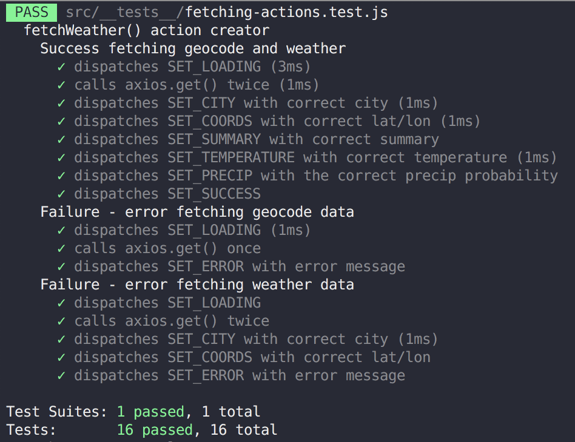

## Testing Thunk-y Redux Actions

<time datetime="2019-11-20">November 20, 2019</time>

In Redux-land, thunk-y action creators are those that return a function and not a plain object. Using them in a Redux store can be achieved with the redux-thunk middleware. And they still need to be tested! With the help of custom middleware to track actions (developed by [Dillon Krug](https://github.com/dillonkrug)), testing them is a breeze.

To demo the testing of thunk-y action creators, we'll create a simple React app that first fetches the latitude and longitude of an inputted city and then uses those coordinates to fetch the current weather of that city. The asynchronous nature of data fetching is where the thunk-y actions will come in to play.

The app has a directory structure as follows:

<!-- prettier-ignore -->
```javascript
src/
--App.js
--index.js 
--actions/
----fetching.actions.js
----geocode.actions.js
----status.actions.js
----weather.actions.js
--components/
----CityForm.js
--reducers/
----geocode.reducer.js
----status.reducer.js
----weather.reducer.js
--store/
----store.js
```

#### Reducers and Redux store

Three reducers are used in this app:

1. `geocode.reducer` for handling state related to the city's coordinates
2. `weather.reducer` for handling state related to the city's weather
3. `status.reducer` for handling data fetching states, e.g. loading, error, and success

All the reducers and their initial states are exported from their respective reducer files and combined into a single `rootReducer` in `store/store.js`. Then we can create the Redux store that incorporates the `redux-thunk` middleware.

<!-- prettier-ignore -->
```javascript
// src/store/store.js
import { combinedReducers, createStore, applyMiddleware } from 'redux'
import thunk from 'redux-thunk'

import { geocodeReducer } from '../reducers/geocode.reducer';
import { statusReducer } from '../reducers/status.reducer';
import { weatherReducer } from '../reducers/weather.reducer';

const rootReducer = combineReducers({
	status: statusReducer,
	geocode: geocodeReducer,
	weather: weatherReducer
})

export const store = createStore(rootReducer, applyMiddleware(thunk))
```

#### Thunk-y actions

Most pertitent to this article are the actions used to fetch data. For that we create a single action creator called `fetchWeather` inside of `actions/fetching.actions.js`.

<!-- prettier-ignore -->
```javascript
import axios from 'axios';

import { setLoading, setError, setSuccess } from './status.actions'
import { setCity, setCoords } from './geocode.actions';
import { setSummary, setTemperature, setPrecip } from './weather.actions';

export const fetchWeather = city => async (dispatch, getState) => {
	dispatch(setLoading());
	try {
		const url1 = `https://api.mapbox.com/geocoding/v5/mapbox.places/${city}.json?access_token=${process.env.REACT_APP_GEOCODE_ACCESS_TOKEN}&limit=1`;
		const { data: { features } } = await axios.get(url1);
		const [lon, lat] = features[0].center;
		dispatch(setCity(city));
		dispatch(setCoords(lat, lon));

		const proxy = 'https://cors-anywhere.herokuapp.com/';
		const url2 = `https://api.darksky.net/forecast/${process.env.REACT_APP_DARK_SKY_API_KEY}/${lat},${lon}`;
		const { data: { currently } } = await axios.get(proxy + url2);
		const { summary, temperature, precipProbability: precip } = currently;
		dispatch(setSummary(summary));
		dispatch(setTemperature(temperature));
		dispatch(setPrecip(precip))
		dispatch(setSuccess());
	} catch (error) {
		dispatch(setError(error))
	}
}
```

The other action creators that `fetchWeather` calls are all synchronous and simple, for instance, `setCity` in `actions/geocode.acitons.js` looks like:

<!-- prettier-ignore -->
```javascript
export const setCity = (city) => ({
	type: "SET_CITY",
	city
})
```

Returing to `fetchWeather`, we see that this thunk-y action takes on the signature of `async (dispatch, getState) => { ... }`, where `dispatch` and `getState` parameters are accesible to the inner function by the redux-thunk middleware. When this action creator is called, it is passed a city name as an argument and then uses the `dispatch` method to indicate that the loading process has begun and if successful, translates the city into lat/lon coordinates and then fetches weather at those coordinates, or catches an error and dispatches it back to the `statusReducer`.

#### Testing async thunk-y actions

At this point we're ready to test `fetchWeather`. Let's start by setting up our Jest testing environment. Jest comes out of the box in a React-app using `create-react-app`, but if you aren't bootstrapping your app using CRA, simply install the library as a dev dependency.

Since `axios` is used as a helper library for HTTP requests, we need to mock its methods (don't make real API calls in your tests!).

<!-- prettier-ignore -->
```javascript
// __tests__/fetching.actions.test.js

jest.mock("axios", () => ({
  get: () =>
    jest.fn(() => {
      throw new Error("axios.get not mocked")
    }),
}))

import axios from "axios"
```

Errors are thrown on mocked functions to make sure that their implementation inside of tests is also mocked. Not necessary, but a nice sanity check to ensure that you are fully in control of any mocked method.

Next, we need to re-create the redux store in this test file, but with an extra middleware applied. The extra middleware is a function called `trackActions` that takes in a context (ctx) object and assigns it an `actions` property that will ultimately be used to collect actions passed through the store. That collection happens through the redux middleware signature of `store => next => action => { ... }`. In our case, we want the inner function to simply push the actions onto `ctx.actions` before moving down the middleware chain.

<!-- prettier-ignore -->
```javascript
// __tests__/fetching.actions.test.js

function trackActions (ctx) {
	ctx.actions = [];
	return store => next => action => {
		ctx.actions.push(action);
		return next(action);
	};
}
```

`trackActions` get used as the final middleware when creating the redux store. The `ctx` object is simply defined before the store is created and then the actual redux store object is assigned some new methods that help extract the tracked actions.

<!-- prettier-ignore -->
```javascript
// __tests__/fetching.actions.test.js

function createTrackedStore (rootReducer, middleware = [thunk]) {
	const ctx = {};
	const store = createStore(rootReducer, applyMiddleware(...middleware, trackActions(ctx)));
	return Object.assign(store, {
		getActions: () => ctx.actions,
		getFirstAction: () => ctx.actions[0],
		getNthAction: (n) => n > ctx.actions.length ? new Error('out of bounds') : ctx.actions[n - 1],
		getLastAction: () => ctx.actions[ctx.actions.length - 1],
		clearActions: () => ctx.actions = [],
	});
}
```

With these functions in place, we're ready to start testing the async thunky action creator. In the setup phase of the test, we create the tracked store and dispatch `fetchWeather` with some sample data. The sample data needs to have the same structure as what the API returns, which looks like:

<!-- prettier-ignore -->
```javascript
const testData = {
	city: 'Baltimore',
	geocode: {
		data: {
			features: [
				{
					center: [100, 100]
				}
			]
		}
	},
	weather: {
		data: {
			currently: {
				summary: 'testSummary',
				temperature: 100,
				precipProbability: .5
			}
		}
	},
	error: new Error('test-error')
}

```

We also need to define the implementation of the axios calls. The first call should return the geocode information and the second should return the weather data.

<!-- prettier-ignore -->
```javascript
describe('fetchWeather() action creator', () => {
	describe('Success fetching geocode and weather', () => {
		let store;
		beforeAll(() => {
			jest.spyOn(axios, 'get')
				.mockResolvedValueOnce(testData.geocode)
				.mockResolvedValueOnce(testData.weather)
			store = createTrackedStore(rootReducer);
			store.dispatch(fetchingActions.fetchWeather(testData.city));
		})
```

Looking back at `fetchWeather`, during a successful fetch, we should see the following action creators get dispatched:

1. setLoading
2. setCity
3. setCoords
4. setSummary
5. setTemperature
6. setPrecip
7. setSuccess

The `setLoading` action creator returns an object with a type `SET_LOADING` and a payload. Therefore, in our tracked store, we should see the first action match that type.

<!-- prettier-ignore -->
```javascript{11-15}
describe('fetchWeather() action creator', () => {
	describe('Success fetching geocode and weather', () => {
		let store;
		beforeAll(() => {
			jest.spyOn(axios, 'get')
				.mockResolvedValueOnce(testData.geocode)
				.mockResolvedValueOnce(testData.weather)
			store = createTrackedStore(rootReducer);
			store.dispatch(fetchingActions.fetchWeather(testData.city));
		})
		it('dispatches SET_LOADING', () => {
			expect(store.getFirstAction()).toEqual({
				type: 'SET_LOADING'
			})
		})
```

The axios `get` methods should then be called twice (one for the geocode and one for the weather).

<!-- prettier-ignore -->
```javascript{16-19}
describe('fetchWeather() action creator', () => {
	describe('Success fetching geocode and weather', () => {
		let store;
		beforeAll(() => {
			jest.spyOn(axios, 'get')
				.mockResolvedValueOnce(testData.geocode)
				.mockResolvedValueOnce(testData.weather)
			store = createTrackedStore(rootReducer);
			store.dispatch(fetchingActions.fetchWeather(testData.city));
		})
		it('dispatches SET_LOADING', () => {
			expect(store.getFirstAction()).toEqual({
				type: 'SET_LOADING'
			})
		})
		it('calls axios.get() twice', async () => {
			expect(axios.get).toHaveBeenCalledTimes(2);
		})
```

Then the remaining action creators get called that place all of the geocode and weather data into the store. For instance, the second action the store receives comes from the `setCity` action creator, which is verified by:

<!-- prettier-ignore -->
```javascript{19-26}
describe('fetchWeather() action creator', () => {
	describe('Success fetching geocode and weather', () => {
		let store;
		beforeAll(() => {
			jest.spyOn(axios, 'get')
				.mockResolvedValueOnce(testData.geocode)
				.mockResolvedValueOnce(testData.weather)
			store = createTrackedStore(rootReducer);
			store.dispatch(fetchingActions.fetchWeather(testData.city));
		})
		it('dispatches SET_LOADING', () => {
			expect(store.getFirstAction()).toEqual({
				type: 'SET_LOADING'
			})
		})
		it('calls axios.get() twice', async () => {
			expect(axios.get).toHaveBeenCalledTimes(2);
		})
		it('dispatches SET_CITY with correct city', () => {
			expect(store.getNthAction(2)).toEqual({
				type: 'SET_CITY',
				city: testData.city
			})
		})
```

Similar tests can be written for the remaining actions in this sequence and also for the two error scenarios (one during fetching geocode data and the other when fetching weather data). In any case, make sure that in the cleanup phase of the tests that any mocked implementations are restored and for good measure, clear any tracked actions in the store.

```javascript{26-29}
describe('fetchWeather() action creator', () => {
	describe('Success fetching geocode and weather', () => {
		let store;
		beforeAll(() => {
			jest.spyOn(axios, 'get')
				.mockResolvedValueOnce(testData.geocode)
				.mockResolvedValueOnce(testData.weather)
			store = createTrackedStore(rootReducer);
			store.dispatch(fetchingActions.fetchWeather(testData.city));
		})
		it('dispatches SET_LOADING', () => {
			expect(store.getFirstAction()).toEqual({
				type: 'SET_LOADING'
			})
		})
		it('calls axios.get() twice', async () => {
			expect(axios.get).toHaveBeenCalledTimes(2);
		})
		it('dispatches SET_CITY with correct city', () => {
			expect(store.getNthAction(2)).toEqual({
				type: 'SET_CITY',
				city: testData.city
			})
		})
		// ... additional tests for remaining actions
		afterAll(() => {
			axios.get.mockRestore();
			store.clearActions();
		})
```

If all goes well, you'll hopefully see a nice Jest summary of green check marks!



<figcaption>Tracking and testing actions ✅✅✅</figcaption>
